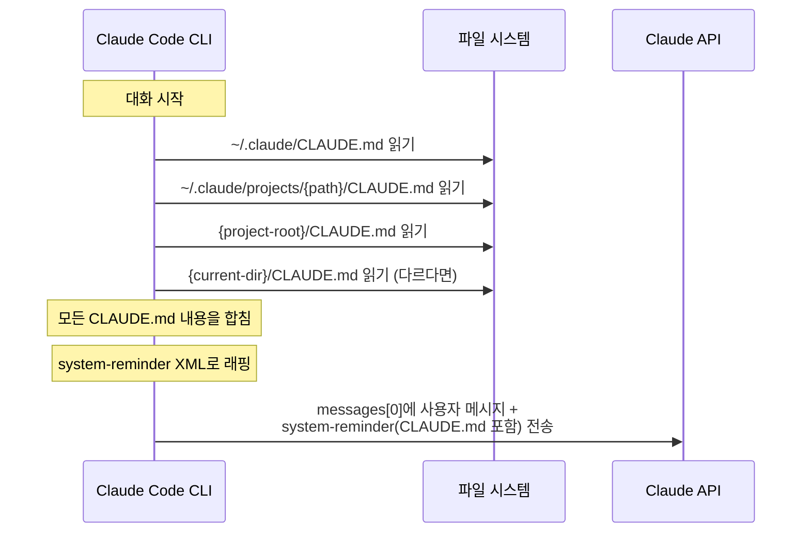
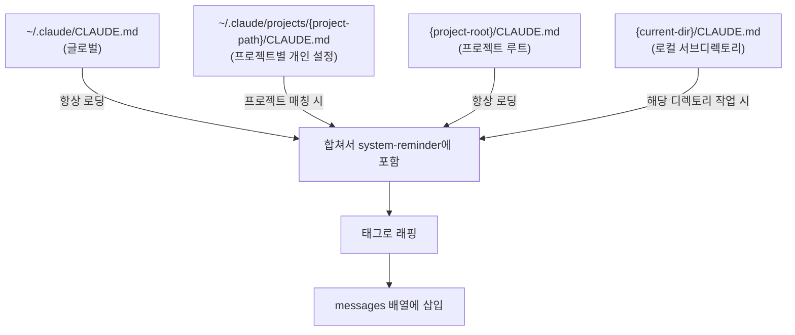
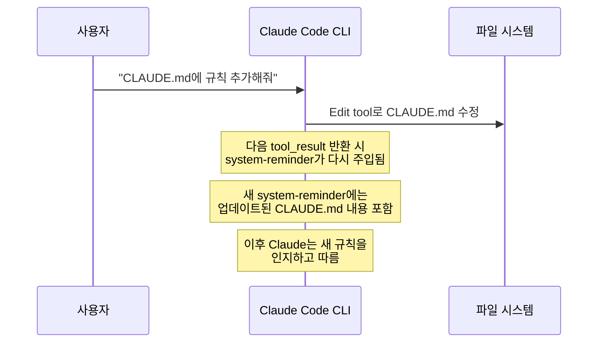

# CLAUDE.md

**한 줄 요약:** CLAUDE.md는 프로젝트별 지시사항 파일이다. system prompt가 아닌 **system-reminder 태그**를 통해 messages 배열 안에 주입되며, "OVERRIDE any default behavior" 문구가 자동으로 붙어 기본 동작보다 우선한다.

## 동작 원리 — 정확히 어떻게 주입되는가

CLAUDE.md는 많은 사람들이 "system prompt에 들어간다"고 생각하지만, 실제로는 그렇지 않다. **messages 배열 안의 system-reminder 태그**로 주입된다.

### 주입 과정



### 실제 주입 형태

CLI가 CLAUDE.md 내용을 messages에 넣을 때의 실제 모습:

```xml
<system-reminder>
As you answer the user's questions, you can use the following context:
# claudeMd
Codebase and user instructions are shown below.
Be sure to adhere to these instructions.
IMPORTANT: These instructions OVERRIDE any default behavior
and you MUST follow them exactly as written.

Contents of /Users/you/project/CLAUDE.md
(user's project instructions):

## 코딩 규칙
- TypeScript strict mode 사용
- 함수형 컴포넌트만 사용
- 테스트는 vitest로 작성

## 커밋 규칙
- Conventional Commits 형식 사용
</system-reminder>
```

핵심 포인트:
- `IMPORTANT: These instructions OVERRIDE any default behavior` — 이 문구가 **자동으로** 붙는다
- `and you MUST follow them exactly as written` — Claude에게 CLAUDE.md 내용을 반드시 따르라고 강제
- system prompt(`system` 파라미터)가 아닌 **messages 안의 태그**이므로, 압축 시 재주입이 필요하다

## 로딩 경로와 우선순위



| 경로 | 용도 | 공유 범위 |
|------|------|----------|
| `~/.claude/CLAUDE.md` | 모든 프로젝트 공통 규칙 | 개인 |
| `~/.claude/projects/{path}/CLAUDE.md` | 특정 프로젝트 개인 규칙 | 개인 |
| `{project-root}/CLAUDE.md` | 프로젝트 팀 공유 규칙 | git에 커밋하면 팀 공유 |
| `{current-dir}/CLAUDE.md` | 서브디렉토리 특화 규칙 | git에 커밋하면 팀 공유 |

나중에 로딩된 것이 먼저 로딩된 것보다 우선한다. 로컬 > 프로젝트 루트 > 프로젝트별 개인 > 글로벌 순서.

## 대화 중 CLAUDE.md가 변경되면?

CLAUDE.md 파일을 대화 중에 수정하면 어떻게 될까?



system-reminder는 대화 중 여러 번 반복 주입된다. CLI가 tool_result를 messages에 추가할 때 최신 CLAUDE.md 내용을 다시 읽어서 새 system-reminder에 포함시킨다. 따라서 대화 중 CLAUDE.md를 수정하면, 다음 도구 호출 결과부터 새 내용이 반영된다.

## 압축과 CLAUDE.md의 관계

context가 압축될 때:
1. 이전 messages의 상세 내용이 요약으로 교체된다
2. 기존 messages에 포함되어 있던 system-reminder도 요약/제거될 수 있다
3. **하지만 CLI가 압축 후 새 system-reminder를 다시 주입한다**
4. 따라서 CLAUDE.md 내용은 압축 후에도 유지된다

이것이 가능한 이유: system-reminder 주입은 Claude가 아닌 **CLI(하네스)**가 담당하기 때문이다. 압축이 일어나도 CLI는 계속 최신 CLAUDE.md를 읽어서 새 메시지에 주입할 수 있다.

## 효과적인 CLAUDE.md 작성

```markdown
# CLAUDE.md

## 프로젝트 개요
이 프로젝트는 VitePress 기반 기술 스터디 사이트다.

## 코딩 규칙
- TypeScript strict mode 사용
- 함수형 컴포넌트만 사용

## 커밋 규칙
- Conventional Commits 형식 사용
- Co-Authored-By 태그 포함하지 않기

## 주의사항
- docs/ 디렉토리 외부 파일은 수정하지 말 것
```

작성 팁:
- **구체적으로** — "코드 잘 짜줘" 대신 "TypeScript strict mode 사용"
- **간결하게** — CLAUDE.md 내용이 길수록 context를 더 많이 차지
- **구조화** — 마크다운 헤더와 리스트로 정리하면 Claude가 파싱하기 쉬움
- **충돌 피하기** — system prompt의 기본 규칙과 모순되지 않도록 주의 (OVERRIDE는 가능하지만 의도적으로)

## 핵심 정리

- CLAUDE.md는 `system` 파라미터가 아닌 **messages 내 system-reminder 태그**로 주입된다
- "OVERRIDE any default behavior" 문구가 자동으로 붙어 기본 동작보다 우선
- 4개 경로에서 로딩되며, 로컬이 글로벌보다 우선
- 대화 중 수정하면 다음 system-reminder 주입 시 반영됨
- 압축 시 사라질 수 있지만 CLI가 재주입하므로 실질적으로 보존됨
