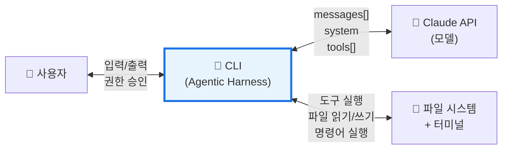
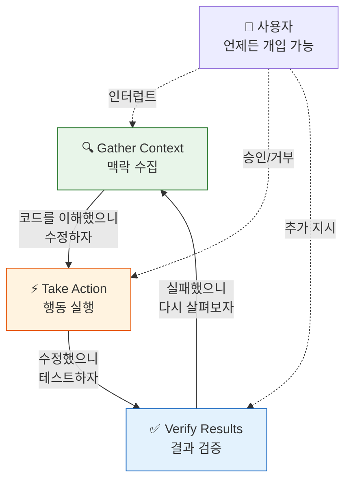
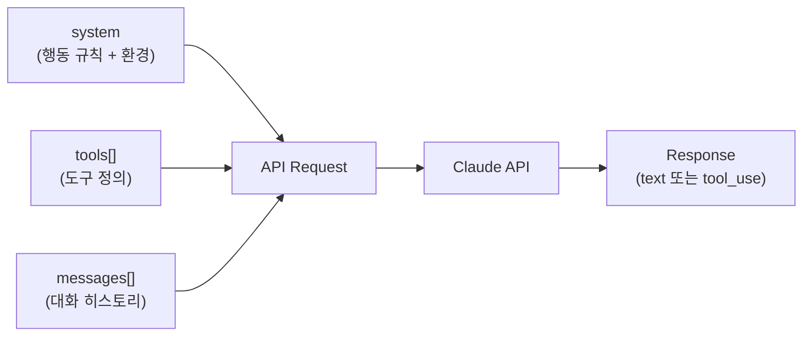
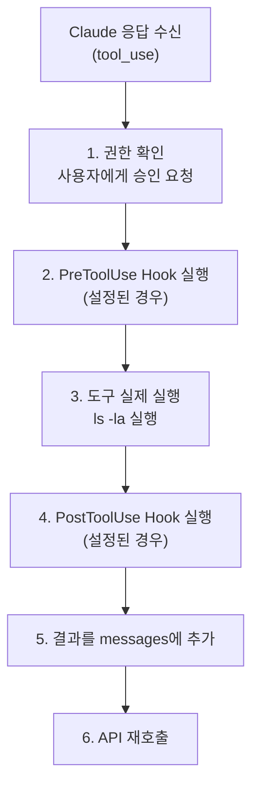
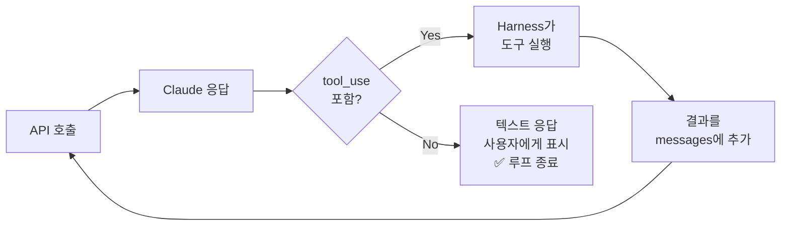
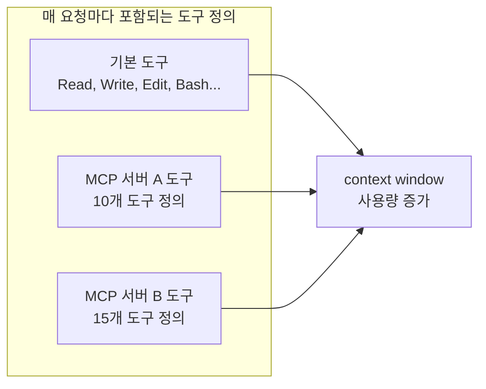

# Context 개요

**한 줄 요약:** Claude Code의 context는 Claude API에 전송되는 `messages[]` 배열 그 자체다. 하지만 이 배열을 **조립하고, 도구를 실행하고, 권한을 관리하고, 압축을 결정하는 것**은 모두 CLI — 즉 "Agentic Harness"의 역할이다.

## 1. Context = API Messages 배열

Claude Code는 근본적으로 **Claude API 클라이언트**다. 우리가 "context window"라고 부르는 것은 API 호출 시 전송되는 세 가지 요소로 구성된다:

```javascript
// 실제 API 호출의 핵심 구조
const response = await anthropic.messages.create({
  model: "claude-opus-4-6",
  max_tokens: 16384,

  // 1) system — 별도 파라미터. messages와 분리되어 전송
  system: "You are Claude Code, Anthropic's official CLI...",

  // 2) tools — 사용 가능한 도구의 JSON Schema 정의
  tools: [
    { name: "Read", description: "...", input_schema: { /* ... */ } },
    { name: "Bash", description: "...", input_schema: { /* ... */ } },
    // ...
  ],

  // 3) messages — 대화의 전체 히스토리. 이것이 "context"의 본체
  messages: [
    { role: "user",      content: [/* 사용자 메시지 + system-reminder */] },
    { role: "assistant", content: [/* Claude 응답 또는 tool_use */] },
    { role: "user",      content: [/* tool_result + system-reminder */] },
    // ... 계속 쌓인다
  ]
});
```

이 구조를 이해하는 것이 중요한 이유: **context window에 무엇이 있느냐가 Claude가 할 수 있는 모든 것을 결정한다.** 파일 내용, 프로젝트 규칙, 이전 대화 — 전부 이 배열 안에 있어야만 Claude가 "알 수 있다."

::: tip 핵심 구분
- **`system`** 파라미터: 모든 요청에 동일하게 전송되는 기본 행동 규칙 + 환경 정보
- **`tools`** 배열: 사용 가능한 도구 정의 (매 요청마다 포함)
- **`messages`** 배열: 대화가 진행되면서 계속 커지는 히스토리 — 이것이 진짜 "context"
:::

## 2. Agentic Harness — CLI의 역할

공식 문서에서 이렇게 말한다:

> "Claude Code serves as the **agentic harness** around Claude: it provides the tools, context management, and execution environment that turn a language model into a capable coding agent."

Claude Code CLI는 단순한 API 래퍼가 아니다. Claude(모델)를 감싸는 **오케스트레이터**다.



### Harness가 하는 일

| 영역 | 설명 |
|------|------|
| **도구 실행** | Claude가 `tool_use`를 반환하면, 실제로 파일을 읽고 명령을 실행하는 것은 Harness |
| **권한 관리** | `Bash`, `Write` 등 위험한 도구는 사용자 승인을 먼저 받음 |
| **system-reminder 주입** | CLAUDE.md, MEMORY.md, git status 등을 매 턴마다 messages에 끼워넣음 |
| **Context 압축** | messages 배열이 한계에 도달하면 요약하여 줄임 |
| **Hooks 실행** | PreToolUse / PostToolUse / Stop 등 사용자 정의 훅을 도구 실행 전후에 실행 |
| **MCP 서버 관리** | 외부 MCP 서버의 도구를 tools 배열에 통합 |

::: warning Claude(모델)가 모르는 것들
Claude는 오직 `system` + `messages` + `tools`만 본다. 다음은 Claude가 **전혀 인지하지 못하는** Harness 레벨의 로직이다:
- Context 압축이 발생했다는 사실
- 사용자가 권한을 거부한 도구 호출이 있었다는 사실
- Hook이 도구 실행 전후로 동작했다는 사실
- Deferred tools가 아직 로드되지 않았다는 사실
:::

## 3. Agentic Loop — 3단계 순환

Claude Code는 세 가지 단계를 **순환**하며 작업을 완수한다:



### 각 단계의 실제 동작

| 단계 | 대표적 도구 | 예시 |
|------|-------------|------|
| **Gather** — 맥락 수집 | `Glob`, `Grep`, `Read`, `Bash(git log)` | 파일 구조 파악, 에러 로그 확인, 코드 검색 |
| **Action** — 행동 실행 | `Edit`, `Write`, `Bash(npm install)` | 코드 수정, 파일 생성, 패키지 설치 |
| **Verify** — 결과 검증 | `Bash(npm test)`, `Bash(tsc)`, `Read` | 테스트 실행, 타입 체크, 결과 확인 |

### 실제 예시: "이 버그 수정해줘"

```
사용자: "tests/user.test.ts가 실패해. 수정해줘"

[Gather] Bash("npm test -- tests/user.test.ts")     → 에러 메시지 확인
[Gather] Read("tests/user.test.ts")                  → 테스트 코드 확인
[Gather] Read("src/user.ts")                         → 원본 코드 확인
[Action] Edit("src/user.ts", ...)                    → 버그 수정
[Verify] Bash("npm test -- tests/user.test.ts")      → 테스트 재실행

→ 실패하면? 다시 [Gather]로 돌아가 에러를 분석하고 루프를 반복
→ 성공하면? 텍스트 응답으로 결과를 보고하고 루프 종료
```

핵심: **각 도구 호출이 루프의 한 번의 반복**이다. Claude는 이전 단계의 결과를 보고 다음에 무엇을 할지 스스로 결정한다. 수십 번의 도구 호출을 연쇄하며 중간에 방향을 수정할 수도 있다.

## 4. Context 조립 시퀀스 — 실제 API 페이로드로 보기

`claude` 명령을 실행하고 첫 응답을 받기까지, 내부에서 실제로 구성되는 데이터를 단계별로 살펴보자.

### Step 1: CLI 시작 — system 파라미터 구성

CLI가 시작되면 가장 먼저 **system prompt**를 조립한다. 이것은 `messages[]`와 별도로 `system` 파라미터로 전송된다.

```javascript
// 실제 system prompt의 구조 (수천 토큰 분량)
const systemPrompt = [
  // ── 기본 정체성 및 행동 규칙 ──
  "You are Claude Code, Anthropic's official CLI for Claude.",
  "You are an interactive agent that helps users with software engineering tasks.",
  "",
  "# Tool Usage Guidelines",
  "- For file searches: use Glob (NOT find or ls)",
  "- For content search: use Grep (NOT grep or rg)", 
  "- For reading files: use Read (NOT cat/head/tail)",
  "- For editing files: use Edit (NOT sed/awk)",
  // ... 수백 줄의 도구 사용법, 보안 규칙, git 규칙 등
  "",
  "# Committing changes with git",
  "Only create commits when requested by the user...",
  // ... 커밋, PR 생성 규칙 등
  "",
  // ── 환경 정보 (동적으로 수집) ──
  "# Environment",
  "Working directory: /Users/you/my-project",
  "Platform: darwin",
  "Shell: zsh",
  "Is a git repository: true",
  "",
  // ── Git Status 스냅샷 ──
  "# gitStatus",
  "Current branch: feature/auth",
  "Status:",
  "M  src/auth.ts",
  "?? src/utils/helper.ts",
  "",
  // ── 최근 커밋 ──  
  "Recent commits:",
  "a1b2c3d fix: resolve token expiration issue",
  "d4e5f6g feat: add OAuth2 login flow",
].join("\n");
```

::: info 실제 크기
system prompt만으로도 **수천 토큰**을 차지한다. 기본 행동 규칙이 매우 상세하기 때문이다. 여기에 환경 정보, git status 등이 추가된다.
:::

### Step 2: tools 배열 구성

Claude가 사용할 수 있는 **도구 정의**를 JSON Schema 형태로 구성한다. 이것도 매 API 요청마다 전송된다.

```javascript
const tools = [
  {
    name: "Read",
    description: "Reads a file from the local filesystem...",
    input_schema: {
      type: "object",
      required: ["file_path"],
      properties: {
        file_path: { type: "string", description: "The absolute path to the file to read" },
        offset: { type: "integer", description: "The line number to start reading from" },
        limit: { type: "integer", description: "Number of lines to read" }
      }
    }
  },
  {
    name: "Edit",
    description: "Performs exact string replacements in files...",
    input_schema: {
      type: "object",
      required: ["file_path", "old_string", "new_string"],
      properties: {
        file_path: { type: "string" },
        old_string: { type: "string" },
        new_string: { type: "string" },
        replace_all: { type: "boolean", default: false }
      }
    }
  },
  {
    name: "Bash",
    description: "Executes a given bash command and returns its output...",
    input_schema: {
      type: "object",
      required: ["command"],
      properties: {
        command: { type: "string" },
        description: { type: "string" },
        timeout: { type: "number" }
      }
    }
  },
  // Glob, Grep, Write, Agent, Skill, ToolSearch...
  // + MCP 서버에서 추가된 도구들
];
```

::: tip Deferred Tools
모든 도구를 처음부터 로드하면 tools 배열이 너무 커진다. 그래서 일부 도구(MCP 도구, 특수 도구)는 **이름만 system-reminder에 목록으로 알려주고**, Claude가 `ToolSearch`를 호출해야 실제 스키마가 로드된다.
:::

### Step 3: 사용자 첫 메시지 + system-reminder 조립

사용자가 메시지를 입력하면, CLI는 여기에 **system-reminder를 결합**하여 `messages[0]`을 만든다.

```javascript
const messages = [
  {
    role: "user",
    content: [
      // ── 사용자가 실제로 입력한 텍스트 ──
      {
        type: "text",
        text: "이 프로젝트 구조 알려줘"
      },
      // ── CLI가 자동으로 붙이는 system-reminder ──
      {
        type: "text",
        text: `<system-reminder>
As you answer the user's questions, you can use the following context:

# claudeMd
Contents of /Users/you/my-project/CLAUDE.md:
  ## 코딩 규칙
  - TypeScript strict mode 사용
  - 모든 함수에 JSDoc 작성
  IMPORTANT: These instructions OVERRIDE any default behavior
  and you MUST follow them exactly as written.

# memory
Contents of /Users/you/.claude/projects/.../MEMORY.md:
- [User Role](user_role.md) — 백엔드 개발자
- [Preferences](preferences.md) — 한국어 응답 선호

# currentDate
Today's date is 2026-04-07.

# gitStatus
Current branch: feature/auth
Status: M src/auth.ts
Recent commits:
a1b2c3d fix: resolve token expiration issue
</system-reminder>`
      }
    ]
  }
];
```

주목할 점:
- `content`가 **문자열이 아니라 배열**이다. 여러 개의 content block을 담을 수 있다.
- 사용자의 실제 입력과 system-reminder가 **같은 user 메시지 안에** 결합된다.
- system-reminder에는 CLAUDE.md, MEMORY.md, 날짜, git status, 스킬 목록 등이 포함된다.

### Step 4: 첫 API 호출

이제 세 가지를 합쳐서 API를 호출한다:

```javascript
const response = await anthropic.messages.create({
  model: "claude-opus-4-6",
  max_tokens: 16384,
  system: systemPrompt,      // Step 1에서 구성한 system prompt
  tools: tools,              // Step 2에서 구성한 도구 정의
  messages: messages          // Step 3에서 구성한 messages 배열
});
```



### Step 5: Claude 응답 처리 — 도구 호출 사이클

Claude가 **도구 호출(tool_use)**을 반환하면, Harness가 이를 처리한다:

```javascript
// Claude의 응답 예시
response.content = [
  {
    type: "tool_use",
    id: "toolu_01ABC",
    name: "Bash",
    input: { command: "ls -la", description: "List files in current directory" }
  }
];
```

Harness는 이 응답을 받아 다음을 수행한다:



코드로 보면:

```javascript
// ── assistant 메시지 추가 (Claude의 tool_use 응답) ──
messages.push({
  role: "assistant",
  content: response.content  // [{ type: "tool_use", id: "toolu_01ABC", ... }]
});

// ── Harness가 도구를 실행하고 결과를 추가 ──
messages.push({
  role: "user",
  content: [
    // 도구 실행 결과
    {
      type: "tool_result",
      tool_use_id: "toolu_01ABC",
      content: "total 48\ndrwxr-xr-x  12 you  staff  384 Apr  7 10:30 .\n-rw-r--r--   1 you  staff  1205 Apr  7 10:28 package.json\n..."
    },
    // 새로운 system-reminder (필요한 경우 갱신된 정보 포함)
    {
      type: "text",
      text: "<system-reminder>\n# currentDate\nToday's date is 2026-04-07.\n...\n</system-reminder>"
    }
  ]
});

// ── 업데이트된 messages로 API 재호출 ──
const nextResponse = await anthropic.messages.create({
  model: "claude-opus-4-6",
  max_tokens: 16384,
  system: systemPrompt,   // system은 동일
  tools: tools,            // tools도 동일
  messages: messages        // messages만 커진다
});
```

### Step 6: 도구 사이클 반복 (Agentic Loop)

Step 5가 **루프**로 반복된다. Claude가 `tool_use` 대신 **텍스트만** 반환하면 루프가 종료된다.



실제 대화에서 messages 배열이 쌓이는 모습:

```
messages[0]: user      → "이 프로젝트 구조 알려줘" + <system-reminder>
messages[1]: assistant → [tool_use: Bash("ls -la")]
messages[2]: user      → [tool_result: "total 48\ndrwxr..."] + <system-reminder>
messages[3]: assistant → [tool_use: Read("package.json")]
messages[4]: user      → [tool_result: "{ \"name\": \"my-app\"...}"]
messages[5]: assistant → [tool_use: Read("src/index.ts")]
messages[6]: user      → [tool_result: "import express from..."]
messages[7]: assistant → "이 프로젝트는 Express 기반의 REST API입니다..."  ← 루프 종료
```

::: warning 매 API 호출마다 전체 messages 전송
API는 stateless다. 매번 `messages[]` **전체**를 전송한다. messages[7]을 받기 위한 API 호출에는 messages[0]~[6]이 모두 포함된다. 이것이 context window가 빠르게 소비되는 근본적 이유다.
:::

## 5. 도구 호출 한 번이 Context에 미치는 영향

도구 호출 한 번은 messages 배열에 **최소 2개의 항목**을 추가한다:

```
┌─────────────────────────────────────────────────────┐
│ messages[N]:   assistant → tool_use    (50~200 토큰) │
│ messages[N+1]: user      → tool_result (가변)        │
│                           + system-reminder (선택적)  │
└─────────────────────────────────────────────────────┘
```

### 도구별 예상 토큰 소비

| 도구 호출 | tool_use (호출) | tool_result (결과) | 합계 |
|-----------|-----------------|-------------------|------|
| `Read("package.json")` — 작은 파일 | ~80 토큰 | ~100 토큰 | **~180 토큰** |
| `Read("src/index.ts")` — 큰 파일 (200줄) | ~80 토큰 | ~2,000 토큰 | **~2,080 토큰** |
| `Bash("npm test")` — 테스트 출력 | ~100 토큰 | ~500 토큰 | **~600 토큰** |
| `Grep("pattern", "src/")` — 검색 결과 | ~120 토큰 | ~300 토큰 | **~420 토큰** |
| `Glob("**/*.ts")` — 파일 목록 | ~80 토큰 | ~200 토큰 | **~280 토큰** |
| `Edit(file, old, new)` — 코드 수정 | ~150 토큰 | ~50 토큰 | **~200 토큰** |

여기에 **system-reminder가 추가되면** 턴당 500~2,000 토큰이 더 소비된다.

### 복합 작업의 context 소비 예시

"이 버그 수정해줘"라는 요청 하나에 도구를 6번 호출하면:

```
도구 호출 6회 × 평균 500 토큰 = ~3,000 토큰 (도구 호출/결과)
system-reminder 3회 × 평균 1,000 토큰 = ~3,000 토큰 (반복 주입)
Claude 최종 응답 = ~500 토큰
─────────────────────────────────────
총 소비: ~6,500 토큰 (한 번의 사용자 요청에)
```

::: tip context 절약 팁
- 큰 파일은 `Read`의 `offset`/`limit`로 필요한 부분만 읽기
- `Grep`으로 먼저 위치를 찾고, 해당 부분만 `Read`하기
- 불필요한 MCP 서버는 비활성화하여 tools 배열 줄이기
- 작업 전환 시 `/clear`로 context 초기화
:::

## 6. Context 관리 명령어

Claude Code는 context를 직접 관리할 수 있는 명령어를 제공한다:

| 명령어 | 역할 |
|--------|------|
| `/context` | 현재 context window의 사용량을 확인. 어떤 요소가 얼마나 공간을 차지하는지 표시 |
| `/compact` | 대화 히스토리를 수동으로 요약. `/compact focus on the API changes`처럼 포커스 지정 가능 |
| `/clear` | context를 완전히 초기화. 관련 없는 작업 전환 시 사용 |
| `/rewind` | 특정 구간을 선택적으로 압축하는 메뉴 |

### MCP 서버의 숨겨진 context 비용

MCP 서버를 연결하면 해당 서버의 **도구 정의가 매 API 요청마다 포함**된다. 서버를 여러 개 연결하면 작업을 시작하기도 전에 상당한 context를 소비할 수 있다.



`/mcp` 명령으로 서버별 context 비용을 확인할 수 있다.

## 7. 핵심 정리

| 개념 | 핵심 포인트 |
|------|------------|
| **Context** | Claude API에 전송되는 `system` + `tools[]` + `messages[]`의 총합 |
| **Agentic Harness** | CLI는 단순 래퍼가 아니라, 도구 실행 · 권한 관리 · context 주입 · 압축 · 훅을 담당하는 오케스트레이터 |
| **Agentic Loop** | Gather → Action → Verify 의 3단계 순환. 각 도구 호출이 한 번의 반복 |
| **system-reminder** | CLAUDE.md, MEMORY.md 등 동적 정보가 user 메시지에 결합되어 반복 주입됨 |
| **루프 종료 조건** | Claude가 tool_use 없이 텍스트만 반환하면 루프 종료 |
| **Context 성장** | 도구 호출마다 최소 2개 messages 추가. API는 stateless이므로 매번 전체 전송 |
| **관리 명령** | `/context`로 모니터링, `/compact`로 압축, `/clear`로 초기화 |

### 다음 문서

- [System Prompt 상세](./system-prompt) — system 파라미터에 들어가는 내용의 구조와 역할
- [CLAUDE.md 동작](./claude-md) — system-reminder로 주입되는 프로젝트 규칙의 메커니즘
- [Memory 시스템](./memory) — MEMORY.md가 context에 반영되는 방식
- [Context 압축](./compression) — messages 배열이 한계에 도달했을 때의 압축 전략
