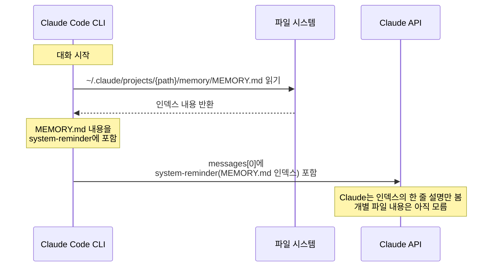
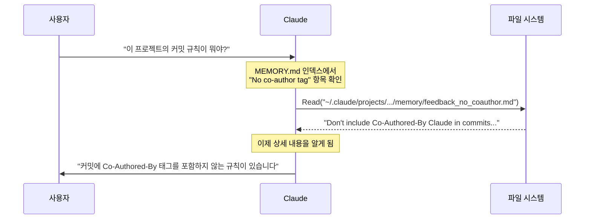
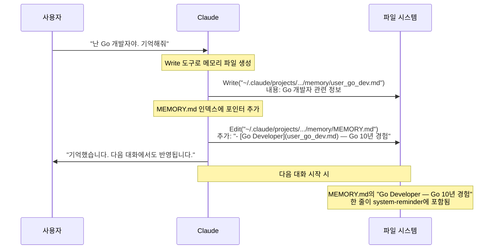

# Memory 시스템

**한 줄 요약:** Memory는 MEMORY.md 인덱스 파일과 개별 메모리 파일로 구성된 파일 기반 기억 시스템이다. 대화 시작 시 **MEMORY.md 인덱스만** system-reminder에 로딩되며, 개별 파일은 Claude가 필요할 때 Read 도구로 직접 읽는다.

## 동작 원리 — 로딩 메커니즘

### 대화 시작 시: MEMORY.md 인덱스만 로딩

많은 사람들이 "Memory가 전부 context에 로딩된다"고 생각하지만, 실제로는 **MEMORY.md 인덱스 파일의 내용만** system-reminder에 포함된다.



실제 system-reminder에 포함되는 형태:

```xml
<system-reminder>
As you answer the user's questions, you can use the following context:
# claudeMd
...
Contents of /Users/you/.claude/projects/.../memory/MEMORY.md
(user's auto-memory, persists across conversations):

- [User Role](user_role.md) — 시니어 백엔드 개발자, Go/Java 전문
- [No co-author tag](feedback_no_coauthor.md) — Don't include Co-Authored-By Claude in commits
- [Project Deadline](project_deadline.md) — 3/5부터 merge freeze
</system-reminder>
```

핵심: **한 줄 설명(`—` 뒤의 텍스트)만 context에 들어간다.** 개별 파일의 상세 내용은 포함되지 않는다.

### 개별 파일 접근: 필요할 때 Read

Claude가 더 자세한 정보가 필요하다고 판단하면, Read 도구로 개별 파일을 직접 읽는다:



이 설계의 이유:
- 메모리 파일이 10개, 20개 쌓여도 **인덱스만 로딩하면 context 비용이 적다**
- 개별 파일은 필요할 때만 읽으므로 context를 효율적으로 사용
- MEMORY.md 인덱스의 한 줄 설명이 충분히 구체적이면, Claude가 어떤 파일을 읽어야 할지 판단할 수 있다

### MEMORY.md의 크기 제한

MEMORY.md 인덱스 파일은 **200줄로 잘려서** system-reminder에 포함된다. 200줄이 넘으면 뒷부분이 truncate된다. 따라서:
- 인덱스의 각 항목은 한 줄로 간결하게 유지
- 더 이상 필요 없는 항목은 정리
- 상세 내용은 반드시 개별 파일에 저장

## 메모리 저장 흐름

Claude가 새 메모리를 저장할 때의 실제 동작:



저장 과정에서 사용되는 도구:
1. **Write** — 개별 메모리 파일 생성 (`user_go_dev.md`)
2. **Edit** — MEMORY.md 인덱스에 새 항목 추가

이 모든 과정은 일반적인 파일 편집이다. Memory 시스템에 특별한 API가 있는 것이 아니라, Claude가 파일 시스템 도구(Write, Edit, Read)를 사용해서 관리하는 것이다.

## 저장 구조

```
~/.claude/projects/{project-path}/memory/
├── MEMORY.md              ← 인덱스 (대화 시작 시 자동 로딩)
├── user_role.md           ← 개별 메모리 (필요 시 Read로 접근)
├── feedback_no_coauthor.md
├── project_deadline.md
└── reference_linear.md
```

### MEMORY.md (인덱스)

```markdown
- [User Role](user_role.md) — 시니어 백엔드 개발자, Go/Java 전문
- [No co-author tag](feedback_no_coauthor.md) — Don't include Co-Authored-By Claude in commits
- [Project Deadline](project_deadline.md) — 3/5부터 merge freeze
- [Linear Tracking](reference_linear.md) — 파이프라인 버그는 Linear INGEST 프로젝트에서 추적
```

### 개별 메모리 파일 예시

```markdown
---
name: User Role
description: 사용자의 역할과 기술 스택
type: user
---

시니어 백엔드 개발자. Go 10년, Java 8년 경험.
React는 처음 접함 — 프론트엔드 설명 시 백엔드 비유 활용.
```

## 메모리 타입

| 타입 | 용도 | 예시 |
|------|------|------|
| **user** | 사용자의 역할, 선호, 지식 수준 | "데이터 사이언티스트, Python 전문" |
| **feedback** | 작업 방식에 대한 교정 | "Co-Authored-By 태그 넣지 마" |
| **project** | 진행 중인 작업, 마감일 | "3/5부터 merge freeze" |
| **reference** | 외부 시스템 위치 정보 | "버그 트래킹은 Linear에서" |

## 저장하면 안 되는 것

- **코드 패턴, 아키텍처** — 코드를 직접 읽으면 됨
- **Git 히스토리** — `git log`가 항상 정확함
- **디버깅 해결책** — 코드와 커밋 메시지에 남아있음
- **CLAUDE.md에 이미 있는 내용** — 중복 로딩으로 context 낭비
- **현재 대화에서만 필요한 임시 정보** — 대화 끝나면 의미 없음

## 핵심 정리

- 대화 시작 시 **MEMORY.md 인덱스만** system-reminder에 로딩 (200줄 제한)
- 개별 메모리 파일은 자동 로딩되지 않음 — Claude가 필요할 때 Read로 읽음
- 저장은 Write(파일 생성) + Edit(인덱스 업데이트)로 수행 — 특별한 API 없음
- 인덱스의 한 줄 설명(`—` 뒤)이 충분히 구체적이어야 Claude가 올바른 파일을 찾을 수 있음
- 코드에서 파악 가능한 정보는 저장하지 않는 것이 context 효율에 좋다
