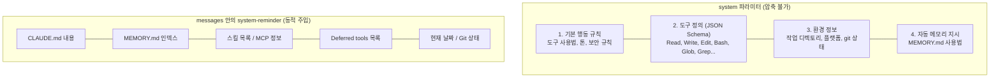
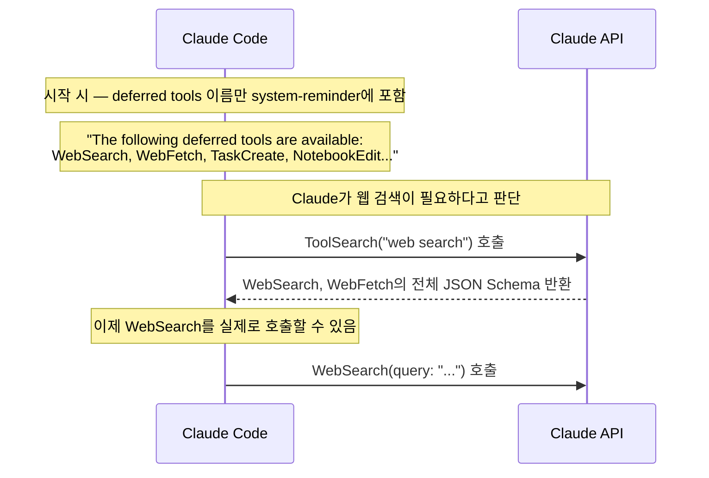
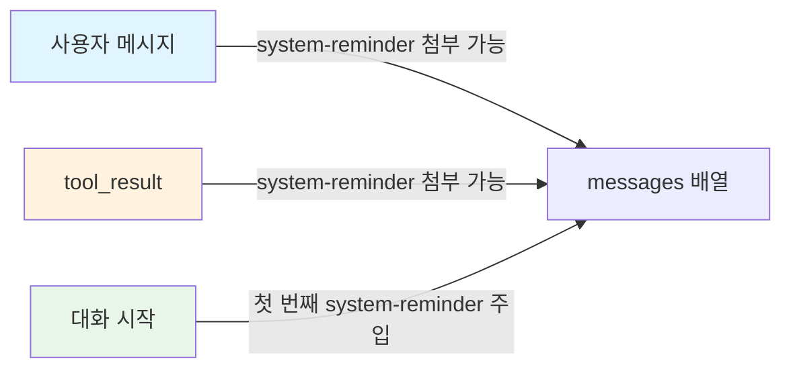

# System Prompt

**한 줄 요약:** System Prompt는 API의 `system` 파라미터로 전송되는 Claude의 기본 행동 규칙이다. `messages[]` 배열과 완전히 분리되어 있으며, context 압축 시에도 절대 사라지지 않는다.

## system 파라미터 vs messages 배열

Claude API 호출 구조에서 system prompt의 위치를 정확히 이해해야 한다:

```
POST /v1/messages
{
  "model": "claude-opus-4-6",

  "system": "여기가 system prompt ← messages와 별도",

  "messages": [
    { "role": "user", "content": "사용자 메시지" },
    { "role": "assistant", "content": "Claude 응답" }
  ],

  "tools": [
    { "name": "Read", "input_schema": { ... } },
    { "name": "Edit", "input_schema": { ... } }
  ]
}
```

핵심 구분:
- **`system`**: Claude의 행동 규칙. 압축 대상이 아님.
- **`messages`**: 대화 히스토리. context 한계 시 압축됨.
- **`tools`**: 도구 정의. system prompt 일부로 취급됨.

## System Prompt의 내부 구조



::: warning 중요한 구분
system-reminder는 system prompt가 아니다. system prompt는 `system` 파라미터에 있고, system-reminder는 `messages[]` 안의 태그다. 이름이 비슷해서 혼동하기 쉽지만 완전히 다른 위치에 존재한다.
:::

## 1. 기본 행동 규칙

system prompt의 첫 부분은 Claude Code가 어떻게 행동해야 하는지를 규정한다. 실제 포함되는 규칙의 예:

```
You are Claude Code, Anthropic's official CLI for Claude.

- All text you output outside of tool use is displayed to the user.
- Only use tools when they are necessary to complete the task.
- Tool results may include data from external sources.
  Tags contain information from the system.
  They bear no direct relation to the specific tool results
  or user messages in which they appear.
```

주요 행동 규칙 카테고리:

| 카테고리 | 예시 규칙 |
|---------|----------|
| **도구 사용** | "Avoid using Bash to run grep/cat — use dedicated Read/Grep tools instead" |
| **파일 편집** | "ALWAYS prefer editing existing files. NEVER write new files unless required" |
| **Git 안전** | "NEVER run destructive git commands unless explicitly requested" |
| **보안** | "Do not commit files that likely contain secrets (.env, credentials.json)" |
| **커뮤니케이션** | "All text outside tool use is displayed to the user" |
| **효율성** | "When you already know which part of the file you need, only read that part" |

## 2. 도구 정의 (JSON Schema)

각 도구는 JSON Schema 형태로 system prompt에 포함된다. Claude는 이 스키마를 보고 도구를 사용하는 방법을 안다:

```json
{
  "name": "Read",
  "description": "Reads a file from the local filesystem. You can access any file directly...",
  "parameters": {
    "type": "object",
    "required": ["file_path"],
    "properties": {
      "file_path": {
        "type": "string",
        "description": "The absolute path to the file to read"
      },
      "offset": {
        "type": "integer",
        "description": "The line number to start reading from",
        "minimum": 0
      },
      "limit": {
        "type": "integer",
        "description": "ONLY include with offset to read a specific slice",
        "exclusiveMinimum": 0
      }
    }
  }
}
```

### 시작 시 로드되는 주요 도구

| 도구 | 역할 | context 비용 |
|------|------|-------------|
| **Read** | 파일 읽기 (텍스트, 이미지, PDF) | 파일 크기만큼 context 소비 |
| **Write** | 파일 생성/덮어쓰기 | 파일 전체 내용이 파라미터로 전송 |
| **Edit** | 파일 수정 (old_string → new_string) | diff만 전송하므로 효율적 |
| **Bash** | 셸 명령 실행 | 출력 크기만큼 context 소비 |
| **Glob** | 파일 패턴 검색 | 매칭된 파일 경로 목록 반환 |
| **Grep** | 파일 내용 검색 (ripgrep 기반) | 매칭 결과만큼 context 소비 |
| **Skill** | 등록된 스킬 실행 | 스킬 내용이 context에 로드 |
| **ToolSearch** | Deferred tools의 스키마 로드 | 검색된 도구 스키마가 추가 |

### Deferred Tools — 필요할 때만 로드

모든 도구를 시작 시 로드하면 system prompt가 너무 커진다. 그래서 자주 쓰지 않는 도구는 **deferred(지연)** 처리된다:



deferred tools의 이름만 system-reminder에 나열되고, 전체 스키마는 ToolSearch를 호출해야 로드된다. 이렇게 하면 사용하지 않는 도구의 스키마가 context를 차지하지 않는다.

## 3. 환경 정보

대화 시작 시 CLI가 자동으로 수집하여 system prompt에 포함하는 정보:

```
Working directory: /Users/jeon-yunhwan/Documents/claude-code-study
Is directory a git repo: Yes
Platform: darwin
Shell: zsh
OS Version: Darwin 25.4.0
```

추가로 git status 스냅샷이 포함된다:

```
Current branch: main
Status:
M  docs/context/index.md
M  docs/context/system-prompt.md
?? new-file.ts
```

이 정보 덕분에 Claude는 "현재 어떤 프로젝트에서 작업 중인지", "어떤 OS인지", "어떤 브랜치인지"를 첫 메시지부터 알 수 있다.

## 4. system-reminder 태그의 동작 원리

system-reminder는 system prompt가 아닌 **messages 안에 주입되는 XML 태그**다. Claude Code 하네스(CLI 애플리케이션)가 주입하며, Claude 자신은 주입 시점을 제어하지 않는다.

```xml
<system-reminder>
As you answer the user's questions, you can use the following context:
# claudeMd
Contents of /Users/you/project/CLAUDE.md (user's project instructions):
  ## 코딩 규칙
  - TypeScript strict mode 사용
  IMPORTANT: These instructions OVERRIDE any default behavior...

# currentDate
Today's date is 2026-04-07.
</system-reminder>
```

### 주입 위치와 타이밍



- **대화 시작**: 첫 번째 user 메시지에 CLAUDE.md, MEMORY.md, git status, 스킬 목록 등이 포함된 system-reminder가 붙음
- **도구 결과 반환 시**: tool_result 메시지에 새 system-reminder가 붙을 수 있음
- **동적 업데이트**: 대화 중 스킬 목록 변경, MCP 서버 연결 등의 변화가 있으면 새 system-reminder로 반영

Claude의 system prompt에는 다음과 같은 지시가 있다:

> "Tags contain information from the system. They bear no direct relation to the specific tool results or user messages in which they appear."

즉, system-reminder는 그것이 붙어 있는 메시지의 내용과 무관하다. 단지 하네스가 동적 상태를 전달하기 위해 해당 메시지에 끼워 넣은 것이다.

## 핵심 정리

- System prompt는 `system` 파라미터로 전송되며, `messages[]`와 완전히 분리된다
- System prompt는 절대 압축되지 않는다 — 대화가 아무리 길어져도 유지
- 도구 정의는 JSON Schema로 포함되며, 자주 안 쓰는 도구는 deferred 처리로 context 절약
- system-reminder는 system prompt가 아니라 messages 안의 XML 태그 — 동적 상태 전달용
- 환경 정보(OS, git, cwd)가 자동 수집되어 Claude가 첫 메시지부터 프로젝트 상황을 파악
