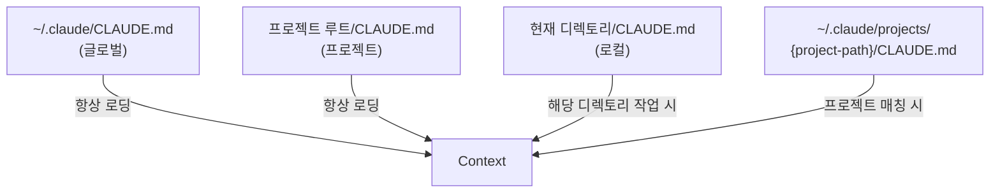

# CLAUDE.md

CLAUDE.md는 프로젝트별 지시사항을 담는 파일이다. Claude Code는 대화 시작 시 이 파일을 자동으로 읽어 context에 포함한다.

## 로딩 경로



### 로딩 순서와 우선순위

1. **글로벌** (`~/.claude/CLAUDE.md`) — 모든 프로젝트에 적용
2. **프로젝트별** (`~/.claude/projects/{path}/CLAUDE.md`) — 특정 프로젝트에 적용
3. **프로젝트 루트** (`./CLAUDE.md`) — 레포 루트의 규칙
4. **로컬** (`./subdir/CLAUDE.md`) — 서브디렉토리 규칙

나중에 로딩된 것이 먼저 로딩된 것보다 우선한다.

## 작성 예시

```markdown
# CLAUDE.md

## 프로젝트 개요
이 프로젝트는 Next.js 기반 웹 앱이다.

## 코딩 규칙
- TypeScript strict mode 사용
- 함수형 컴포넌트만 사용
- 테스트는 vitest로 작성

## 커밋 규칙
- Conventional Commits 형식 사용
- Co-Authored-By 태그 포함하지 않기
```

## 실제 동작

Claude Code가 CLAUDE.md를 읽으면, 그 내용이 system-reminder 태그 안에 포함된다:

```xml
<system-reminder>
Contents of /Users/you/project/CLAUDE.md:
  ## 코딩 규칙
  - TypeScript strict mode 사용
  ...
  IMPORTANT: These instructions OVERRIDE any default behavior
</system-reminder>
```

`IMPORTANT: These instructions OVERRIDE any default behavior` — 이 문구가 자동으로 붙어서 CLAUDE.md의 지시가 기본 동작보다 우선하게 된다.

## 핵심 정리

- CLAUDE.md = 프로젝트별 "규칙서"
- 여러 경로에서 로딩되며, 로컬이 글로벌보다 우선
- system-reminder로 context에 주입되며 기본 동작을 오버라이드
- 팀원과 공유하려면 프로젝트 루트에, 개인 설정은 `~/.claude/`에 배치
