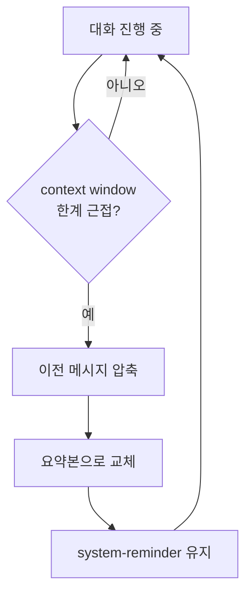

# Context 압축

Claude Code는 대화가 길어져 context window 한계에 가까워지면 **자동으로 이전 메시지를 압축**한다.

## 압축 동작 흐름



## 압축 시 보존되는 것

| 보존됨 | 압축/제거됨 |
|--------|------------|
| System Prompt | 이전 대화 메시지 상세 내용 |
| CLAUDE.md 내용 | 이전 도구 호출의 전체 결과 |
| Memory (MEMORY.md) | 중간 탐색/검색 과정 |
| 최근 메시지 | 오래된 메시지 |
| 현재 작업 context | 완료된 작업의 상세 과정 |

## 실제 동작 예시

대화가 길어지면 이런 메시지가 나타난다:

```
The system will automatically compress prior messages
in your conversation as it approaches context limits.
```

압축 전:
```
[메시지 1] 사용자: "이 파일 읽어줘"
[메시지 2] Claude: Read tool → 파일 전체 내용 (500줄)
[메시지 3] 사용자: "이 함수 수정해줘"
[메시지 4] Claude: Edit tool → 수정 내용
...
[메시지 20] 사용자: "테스트 실행해줘"
```

압축 후:
```
[요약] 이전 대화에서 파일을 읽고 함수를 수정함. 수정 내용: ...
[메시지 18~20] (최근 메시지는 원본 유지)
```

## 압축에 대비하는 방법

1. **중요한 정보는 파일에 저장** — 대화에만 있는 정보는 압축될 수 있다
2. **Memory 활용** — 다음 대화에서도 필요한 정보는 Memory에 저장
3. **CLAUDE.md 활용** — 프로젝트 규칙은 CLAUDE.md에 두면 압축되지 않음
4. **Plan/Task 활용** — 작업 계획은 도구를 통해 저장하면 context 외부에 보존

## 핵심 정리

- Context window 한계 접근 시 자동 압축 발동
- System Prompt, CLAUDE.md, Memory는 압축되지 않고 보존
- 이전 대화 내용은 요약본으로 교체
- 중요한 정보는 파일/Memory/CLAUDE.md에 저장하여 보존
