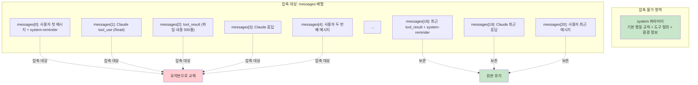
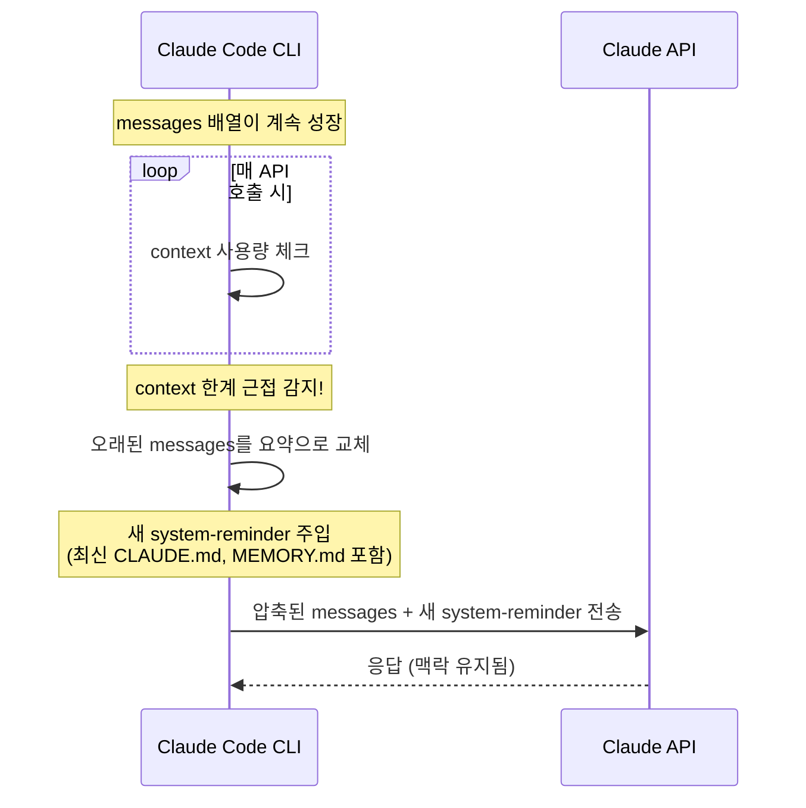
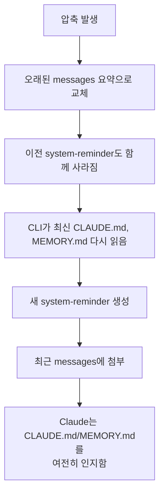

# Context 압축

**한 줄 요약:** Context 압축은 `messages[]` 배열이 한계에 근접하면 이전 메시지를 요약으로 교체하는 메커니즘이다. `system` 파라미터는 절대 압축되지 않으며, CLAUDE.md와 MEMORY.md는 system-reminder 재주입을 통해 보존된다.

## 동작 원리 — 무엇이 압축되고 무엇이 안 되는가

### API 구조에서의 압축 대상



정리:
- **`system` 파라미터** — 절대 압축 안 됨. 기본 규칙과 도구 정의는 항상 유지.
- **오래된 messages** — 요약본으로 교체됨. 도구 호출의 상세 결과, 긴 파일 내용 등이 축약.
- **최근 messages** — 원본 그대로 유지. Claude가 현재 작업 맥락을 잃지 않도록.

### 압축 트리거와 과정



## 실제 예시 — 압축 전후 비교

### 압축 전 messages 배열

```javascript
messages = [
  // 오래된 메시지들 (상세 내용 포함)
  { role: "user",      content: "프로젝트 구조 알려줘" + "<system-reminder>CLAUDE.md...</system-reminder>" },
  { role: "assistant", content: [{ type: "tool_use", name: "Bash", input: { command: "ls -la" } }] },
  { role: "user",      content: [{ type: "tool_result", content: "total 48\ndrwxr-x... (50줄)" }] },
  { role: "assistant", content: "이 프로젝트는 VitePress 기반으로..." },
  { role: "user",      content: "package.json 보여줘" },
  { role: "assistant", content: [{ type: "tool_use", name: "Read", input: { file_path: "package.json" } }] },
  { role: "user",      content: [{ type: "tool_result", content: "{ \"name\": ... (80줄)" }] },
  { role: "assistant", content: "의존성을 보면 vitepress 1.x를 사용하고..." },
  // ... 중간 30개 메시지 생략 ...
  // 최근 메시지들
  { role: "user",      content: "빌드 에러 고쳐줘" },
  { role: "assistant", content: [{ type: "tool_use", name: "Bash", input: { command: "npm run build" } }] },
  { role: "user",      content: [{ type: "tool_result", content: "Error: ..." }] + "<system-reminder>..." },
  { role: "assistant", content: "빌드 에러를 확인했습니다..." },
]
```

### 압축 후 messages 배열

```javascript
messages = [
  // 오래된 메시지 → 요약으로 교체
  { role: "user", content: "[이전 대화 요약] 사용자가 프로젝트 구조를 파악하고 package.json을 확인함. VitePress 1.x 기반 프로젝트이며, 여러 파일을 수정하고 테스트를 진행함." },

  // 새로 주입된 system-reminder (CLAUDE.md, MEMORY.md 재포함)
  // CLI가 최근 메시지에 첨부

  // 최근 메시지 → 원본 유지
  { role: "user",      content: "빌드 에러 고쳐줘" },
  { role: "assistant", content: [{ type: "tool_use", name: "Bash", input: { command: "npm run build" } }] },
  { role: "user",      content: [{ type: "tool_result", content: "Error: ..." }] + "<system-reminder>최신 CLAUDE.md + MEMORY.md</system-reminder>" },
  { role: "assistant", content: "빌드 에러를 확인했습니다..." },
]
```

### 변화 포인트

| 항목 | 압축 전 | 압축 후 |
|------|--------|--------|
| messages 수 | ~40개 | ~6개 |
| 이전 파일 읽기 결과 | 원본 전문 (500줄) | "파일을 확인함" 한 줄 |
| 이전 도구 호출 | 입력/출력 전체 | 요약만 |
| **system 파라미터** | **그대로** | **그대로** |
| **CLAUDE.md 내용** | **이전 system-reminder에 있었음** | **새 system-reminder로 재주입** |
| **MEMORY.md 인덱스** | **이전 system-reminder에 있었음** | **새 system-reminder로 재주입** |
| 최근 메시지 | 원본 | 원본 유지 |

## system-reminder 재주입이 핵심

압축에서 가장 중요한 메커니즘은 **system-reminder 재주입**이다.



만약 재주입이 없다면:
- CLAUDE.md 내용이 오래된 messages와 함께 요약/제거됨
- Claude가 프로젝트 규칙을 "잊게" 됨
- MEMORY.md 인덱스도 사라져서 메모리 접근 불가

CLI가 재주입을 담당하기 때문에 이 문제가 방지된다. **Claude 자신이 아닌 CLI(하네스)가 주입하는 구조**이므로, 압축 여부와 관계없이 항상 최신 상태를 반영할 수 있다.

## 압축으로 잃어버리는 것 vs 지켜지는 것

### 잃어버리는 것
- 이전에 읽은 파일의 상세 내용
- 이전 도구 호출의 정확한 입출력
- 중간 탐색/검색 과정의 디테일
- 이전 대화에서의 정확한 문맥과 뉘앙스

### 지켜지는 것
- `system` 파라미터 전체 (행동 규칙, 도구 정의, 환경 정보)
- CLAUDE.md 내용 (재주입)
- MEMORY.md 인덱스 (재주입)
- 최근 메시지의 원본
- 이전 대화의 핵심 요약 (완전 삭제가 아닌 요약)

## 압축에 대비하는 전략

context 압축은 피할 수 없다. 긴 작업에서는 반드시 일어난다. 대비 방법:

**1. 중요한 결정사항은 파일에 기록**
```
사용자: "이 설계 결정 기억해둬"
→ Claude가 Memory에 저장하거나 CLAUDE.md에 추가
→ 압축 후에도 system-reminder로 재주입됨
```

**2. CLAUDE.md에 프로젝트 규칙 명시**
```
CLAUDE.md에 있는 규칙 → 압축 후에도 재주입으로 유지
대화에서만 말한 규칙 → 압축 시 요약으로 축약될 수 있음
```

**3. 파일 읽기를 최소화**
```
Read(file_path, offset=100, limit=20)  ← 필요한 부분만 읽기
Read(file_path)                         ← 전체 읽기 = context 낭비
```
큰 파일을 통째로 읽으면 그 내용이 messages에 들어가 context를 빠르게 소모한다. system prompt에도 "only read the parts of files you need"라는 규칙이 있는 이유다.

**4. 새 대화 시작**
```
작업 맥락이 완전히 바뀔 때 → 새 대화 시작
새 대화 = 깨끗한 messages 배열 + 신선한 context
MEMORY.md에 저장한 정보는 새 대화에서도 자동 로딩
```

## 핵심 정리

- 압축 대상은 `messages[]` 배열이며, `system` 파라미터는 절대 압축되지 않는다
- 오래된 messages가 요약으로 교체되고, 최근 messages는 원본 유지
- CLAUDE.md와 MEMORY.md는 **system-reminder 재주입**으로 압축 후에도 보존
- 재주입은 Claude가 아닌 CLI(하네스)가 담당 — 압축과 무관하게 항상 최신 상태 반영
- 긴 작업에서는 중요한 정보를 파일(CLAUDE.md, Memory)에 저장하여 압축에 대비
