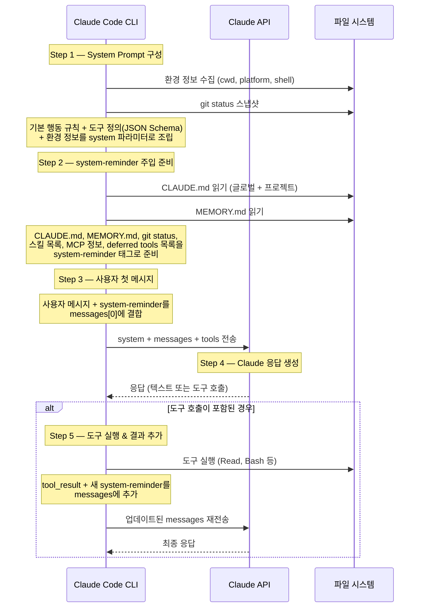
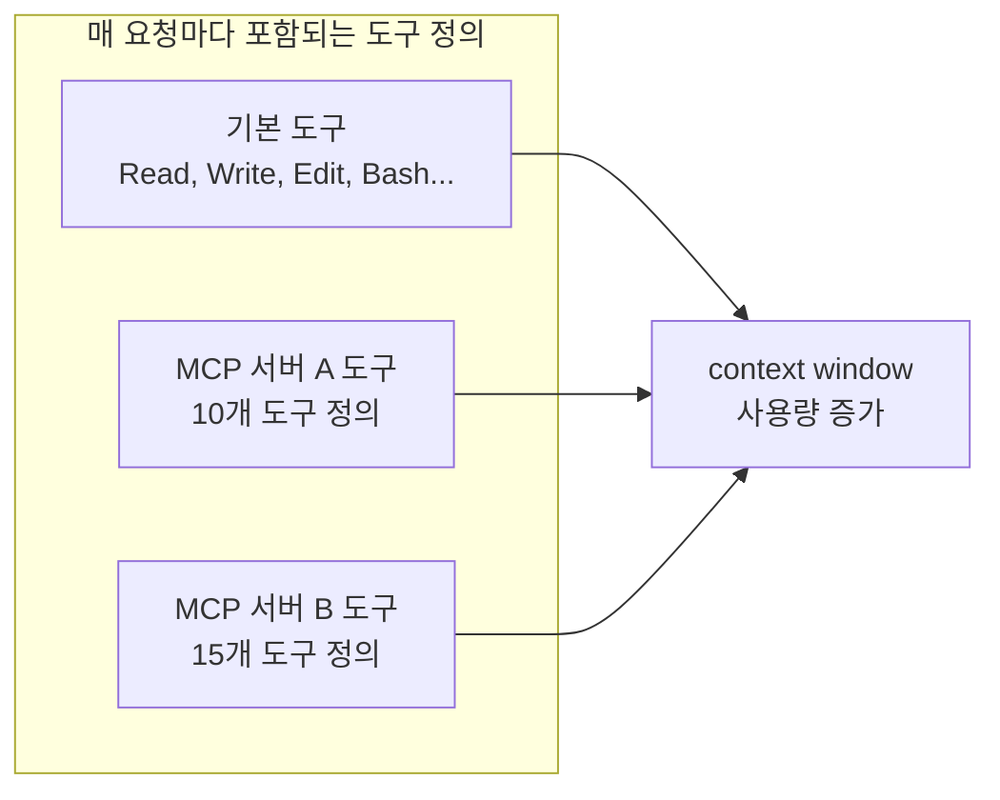

# Context 개요

**한 줄 요약:** Claude Code의 context는 Claude API에 전송되는 `messages[]` 배열 그 자체다. CLI가 시작되면 시스템 프롬프트를 구성하고, 대화가 진행될수록 이 배열이 커지며, 한계에 도달하면 압축된다.

## Context = API Messages 배열

Claude Code는 근본적으로 **Claude API 클라이언트**다. 우리가 "context window"라고 부르는 것은 API 호출 시 전송되는 두 가지 요소로 구성된다:

```
┌─────────────────────────────────────────┐
│  API Request                            │
│                                         │
│  system: "..." ← system 파라미터 (별도)  │
│                                         │
│  messages: [                            │
│    { role: "user", content: "..." },    │
│    { role: "assistant", content: "..." },│
│    { role: "user", content: "..." },    │
│    ...                                  │
│  ]                                      │
│                                         │
│  tools: [ ... ] ← 도구 정의             │
└─────────────────────────────────────────┘
```

- **`system` 파라미터**: 기본 행동 규칙, 환경 정보 등. `messages[]` 배열과 분리되어 전송된다.
- **`messages[]` 배열**: 사용자 메시지, Claude 응답, 도구 호출 결과가 순서대로 쌓인다.
- **`tools[]`**: 사용 가능한 도구의 JSON Schema 정의.

이 구조를 이해하는 것이 중요한 이유: **context window에 무엇이 있느냐가 Claude가 할 수 있는 모든 것을 결정한다.** 파일 내용, 프로젝트 규칙, 이전 대화 — 전부 이 배열 안에 있어야만 Claude가 "알 수 있다."

## Context 조립 시퀀스

`claude` 명령을 실행하고 첫 응답을 받기까지, 내부에서는 다음 과정이 일어난다:



### 각 단계 상세

**Step 1 — System Prompt 구성**
- 기본 행동 규칙 (도구 사용법, 보안 규칙, 톤)
- 도구 정의: Read, Write, Edit, Bash, Glob, Grep, Agent 등의 JSON Schema
- 환경 정보: 작업 디렉토리, 플랫폼, 셸, git 상태
- 이 모든 것이 `system` 파라미터로 전송됨 (messages와 별도)

**Step 2 — system-reminder 주입**
- CLAUDE.md 내용 (모든 경로에서 수집)
- MEMORY.md 인덱스 내용
- Git status 스냅샷
- 사용 가능한 스킬 목록
- MCP 서버 정보
- Deferred tools 목록 (아직 로드되지 않은 도구 이름)
- 현재 날짜
- 이것들은 `<system-reminder>` XML 태그로 래핑됨

**Step 3 — 사용자 메시지**
- 사용자가 입력한 텍스트가 messages 배열의 첫 항목이 됨
- system-reminder가 이 메시지에 첨부될 수 있음

**Step 4 — Claude 응답**
- Claude가 텍스트 응답 또는 도구 호출(tool_use)을 반환

**Step 5 — 도구 실행 사이클**
- 도구 호출이 있으면 CLI가 실행하고 결과를 messages에 추가
- 결과에 새로운 system-reminder가 붙을 수 있음
- Claude가 다시 응답 → 또 도구 호출 → 반복

## 대화가 진행되면서 messages 배열이 쌓이는 모습

```
messages[0]: { role: "user",      content: "이 프로젝트 구조 알려줘" + <system-reminder>... }
messages[1]: { role: "assistant", content: [tool_use: Bash("ls -la")] }
messages[2]: { role: "user",      content: [tool_result: "total 48\ndrwxr..."] + <system-reminder>... }
messages[3]: { role: "assistant", content: [tool_use: Read("package.json")] }
messages[4]: { role: "user",      content: [tool_result: "{ \"name\": ...}"] }
messages[5]: { role: "assistant", content: "이 프로젝트는 Next.js 기반이며..." }
messages[6]: { role: "user",      content: "테스트 실행해줘" }
messages[7]: { role: "assistant", content: [tool_use: Bash("npm test")] }
messages[8]: { role: "user",      content: [tool_result: "PASS ..."] + <system-reminder>... }
messages[9]: { role: "assistant", content: "모든 테스트가 통과했습니다." }
```

주목할 점:
- 모든 도구 호출은 **2개의 messages 항목**을 소비한다 (tool_use + tool_result)
- 큰 파일을 읽으면 그 내용 전체가 messages에 들어가므로 context를 크게 소비
- system-reminder는 여러 메시지에 반복적으로 주입될 수 있다

## Context의 우선순위

정보가 충돌할 때 Claude Code가 따르는 우선순위:

1. **사용자의 직접 지시** — 대화에서 직접 말한 것
2. **CLAUDE.md 지시** — "OVERRIDE any default behavior" 문구가 붙어 강제됨
3. **system-reminder 내 동적 정보** — 스킬, MCP 등
4. **기본 System Prompt** — 시스템 기본 행동 규칙

## Context 관리 명령어

Claude Code는 context를 직접 관리할 수 있는 명령어를 제공한다:

| 명령어 | 역할 |
|--------|------|
| `/context` | 현재 context window의 사용량을 확인. 어떤 요소가 얼마나 공간을 차지하는지 표시 |
| `/compact` | 대화 히스토리를 수동으로 요약. `/compact focus on the API changes`처럼 포커스 지정 가능 |
| `/clear` | context를 완전히 초기화. 관련 없는 작업 전환 시 사용 |
| `/rewind` | 특정 구간을 선택적으로 압축하는 메뉴 |

### MCP 서버의 숨겨진 context 비용

MCP 서버를 연결하면 해당 서버의 **도구 정의가 매 API 요청마다 포함**된다. 서버를 여러 개 연결하면 작업을 시작하기도 전에 상당한 context를 소비할 수 있다.



`/mcp` 명령으로 서버별 context 비용을 확인할 수 있다.

## 핵심 정리

- Context window = Claude API에 전송되는 `system` 파라미터 + `messages[]` 배열
- `system`은 별도 파라미터로 전송되며, `messages[]`와 분리됨
- 대화 시작 시: system prompt 구성 → system-reminder 주입 → 사용자 메시지 수신 → API 호출
- 도구 호출마다 messages 배열에 2개 항목이 추가되어 context가 빠르게 성장
- `/context`로 사용량 모니터링, `/compact`로 수동 압축, `/clear`로 초기화 가능
- MCP 서버의 도구 정의가 매 요청마다 포함되므로 서버 수에 주의
- [System Prompt 상세](./system-prompt) | [CLAUDE.md 동작](./claude-md) | [Memory 시스템](./memory) | [Context 압축](./compression)
