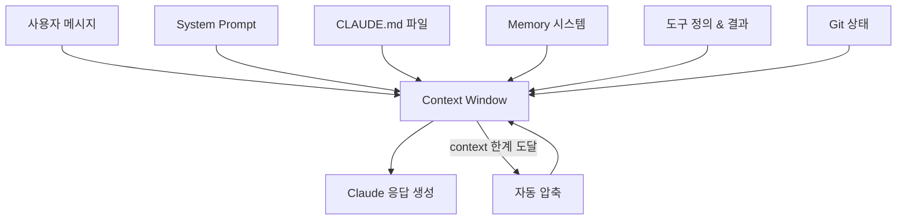

# Context 개요

Claude Code는 대화 시작 시 여러 소스에서 정보를 수집하여 **하나의 context window**를 구성한다. 이 context가 Claude가 "아는 것"의 전부다.

## Context 구성 요소

## 각 요소 설명

| 요소 | 역할 | 상세 |
|------|------|------|
| System Prompt | Claude의 기본 행동 규칙, 도구 사용법 정의 | [상세 보기](./system-prompt) |
| CLAUDE.md | 프로젝트별 지시사항, 코딩 규칙 | [상세 보기](./claude-md) |
| Memory | 대화 간 지속되는 정보 저장 | [상세 보기](./memory) |
| Compression | Context window 한계 시 자동 압축 | [상세 보기](./compression) |

## Context의 우선순위

Claude Code는 정보가 충돌할 때 다음 우선순위를 따른다:

1. **사용자의 직접 지시** (대화에서 직접 말한 것)
2. **CLAUDE.md 파일** (프로젝트 규칙)
3. **Superpowers 스킬** (플러그인 동작)
4. **기본 System Prompt** (시스템 기본값)

## 핵심 정리

- Context window = Claude가 한 번에 볼 수 있는 모든 정보의 합
- 대화가 길어지면 자동으로 이전 메시지를 압축
- CLAUDE.md와 Memory는 매 대화 시작 시 자동으로 로딩
- 우선순위: 사용자 지시 > CLAUDE.md > 스킬 > 시스템 기본값
