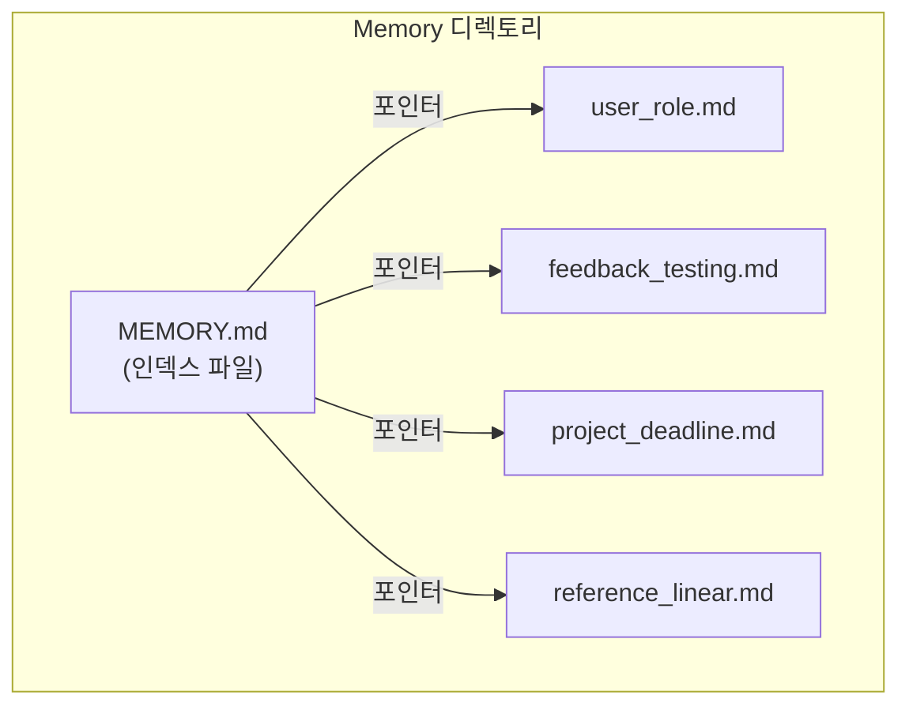
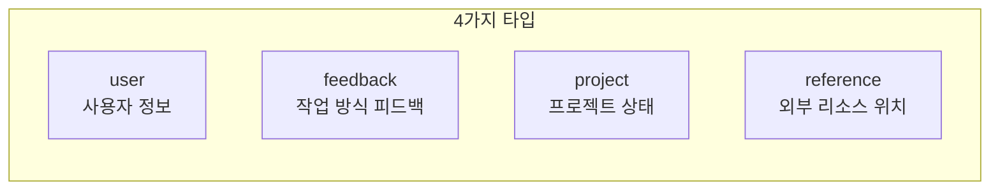
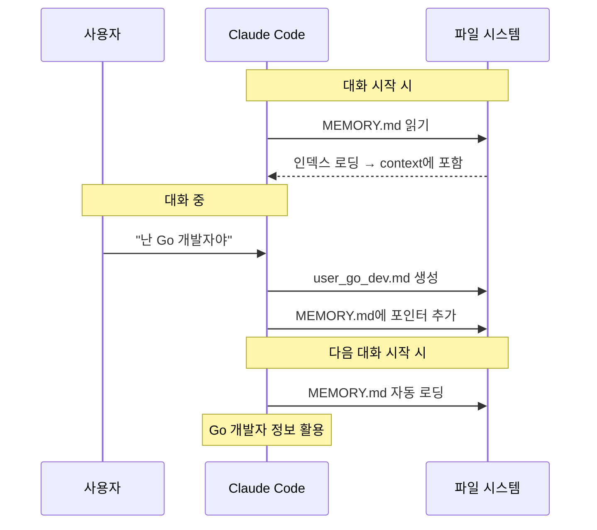

# Memory 시스템

Memory는 Claude Code가 **대화 간에 지속되는 정보**를 저장하는 파일 기반 시스템이다. 대화가 끝나도 사라지지 않으며, 다음 대화에서 자동으로 로딩된다.

## 저장 구조



### 파일 구조

**MEMORY.md** (인덱스):
```markdown
- [User Role](user_role.md) — 시니어 백엔드 개발자, Go/Java 전문
- [Testing Feedback](feedback_testing.md) — DB mock 사용 금지
```

**개별 메모리 파일** (예: `user_role.md`):
```markdown
---
name: User Role
description: 사용자의 역할과 기술 스택
type: user
---

시니어 백엔드 개발자. Go 10년, Java 8년 경험.
React는 처음 접함 — 프론트엔드 설명 시 백엔드 비유 활용.
```

## 메모리 타입



| 타입 | 용도 | 예시 |
|------|------|------|
| **user** | 사용자의 역할, 선호, 지식 수준 | "데이터 사이언티스트, 로깅 조사 중" |
| **feedback** | 작업 방식에 대한 교정/확인 | "DB mock 쓰지 마 — 프로덕션 마이그레이션 실패 경험" |
| **project** | 진행 중인 작업, 마감일, 의사결정 | "3/5부터 merge freeze — 모바일 릴리즈" |
| **reference** | 외부 시스템 위치 정보 | "파이프라인 버그는 Linear INGEST 프로젝트에서 추적" |

## 저장/조회 흐름



## 저장하면 안 되는 것

- 코드 패턴, 아키텍처 — 코드를 직접 읽으면 됨
- Git 히스토리 — `git log`가 정확함
- 디버깅 해결책 — 코드와 커밋 메시지에 있음
- CLAUDE.md에 이미 있는 내용
- 현재 대화에서만 필요한 임시 정보

## 핵심 정리

- Memory = 대화 간 지속되는 파일 기반 기억 시스템
- MEMORY.md가 인덱스, 개별 `.md` 파일이 실제 내용
- 4가지 타입: user, feedback, project, reference
- 대화 시작 시 MEMORY.md가 자동으로 context에 로딩
- 코드에서 파악 가능한 정보는 저장하지 않음
