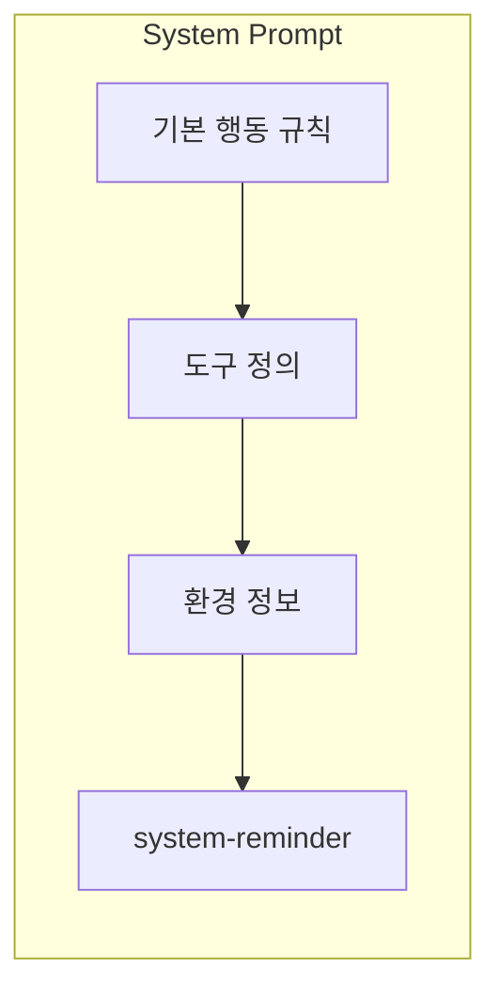

# System Prompt

System Prompt는 Claude Code가 시작될 때 가장 먼저 주입되는 지시사항이다. 사용자에게는 보이지 않지만, Claude의 모든 행동을 규정하는 기본 규칙이 담겨 있다.

## System Prompt의 구성



### 1. 기본 행동 규칙

Claude Code가 어떻게 행동해야 하는지를 정의한다.

```
# System
- All text you output outside of tool use is displayed to the user.
- Tools are executed in a user-selected permission mode.
- Tool results may include data from external sources.
```

주요 규칙:
- 도구 사용 외의 모든 텍스트는 사용자에게 표시
- 사용자가 도구 실행을 승인/거부 가능
- 보안 취약점을 만들지 않도록 주의

### 2. 도구 정의 (Tools)

Claude Code가 사용할 수 있는 도구가 JSON Schema 형태로 정의된다.

```json
{
  "name": "Read",
  "description": "Reads a file from the local filesystem.",
  "parameters": {
    "file_path": { "type": "string" },
    "offset": { "type": "integer" },
    "limit": { "type": "integer" }
  }
}
```

주요 도구들:
- **Read** — 파일 읽기
- **Write** — 파일 생성
- **Edit** — 파일 수정 (diff 기반)
- **Bash** — 셸 명령 실행
- **Glob** — 파일 패턴 검색
- **Grep** — 파일 내용 검색
- **Agent** — 서브에이전트 생성

### 3. 환경 정보

대화 시작 시 자동으로 수집되는 정보:

```
# Environment
- Primary working directory: /Users/you/project
- Platform: darwin
- Shell: zsh
- Is a git repository: true
- Git branch: main
```

### 4. system-reminder 태그

대화 도중에 동적으로 주입되는 추가 정보. 도구 결과나 메시지 안에 `<system-reminder>` 태그로 포함된다.

```xml
<system-reminder>
  Available skills: commit, review-pr, ...
  MCP servers: context7, ...
  CLAUDE.md contents: ...
</system-reminder>
```

주입되는 내용:
- 사용 가능한 스킬 목록
- MCP 서버 정보
- CLAUDE.md 내용
- Memory (MEMORY.md) 내용
- Git 상태 스냅샷

## 핵심 정리

- System Prompt = Claude Code의 "운영체제" 같은 역할
- 사용자에게 직접 보이지 않지만 모든 행동의 기반
- 도구 정의가 JSON Schema로 포함되어 있어 Claude가 도구 사용법을 안다
- system-reminder로 대화 중에도 동적으로 context가 추가된다
