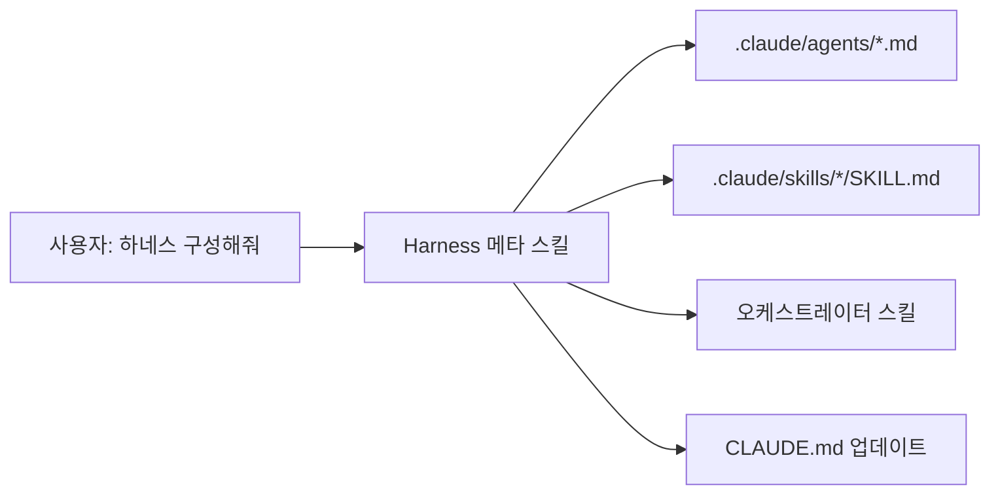
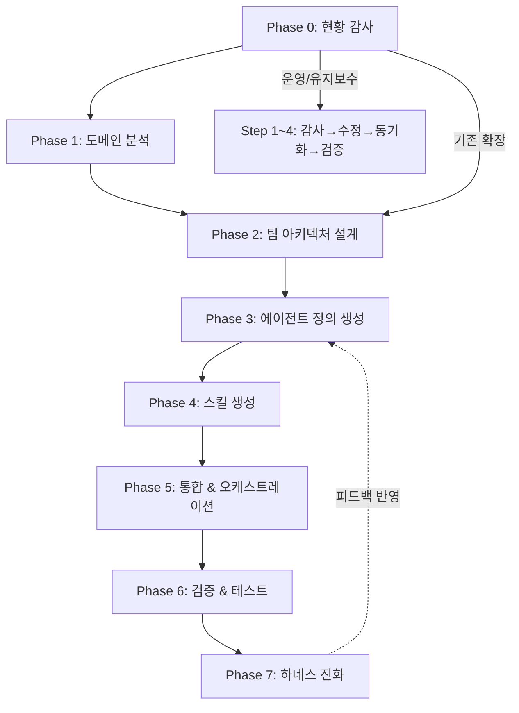
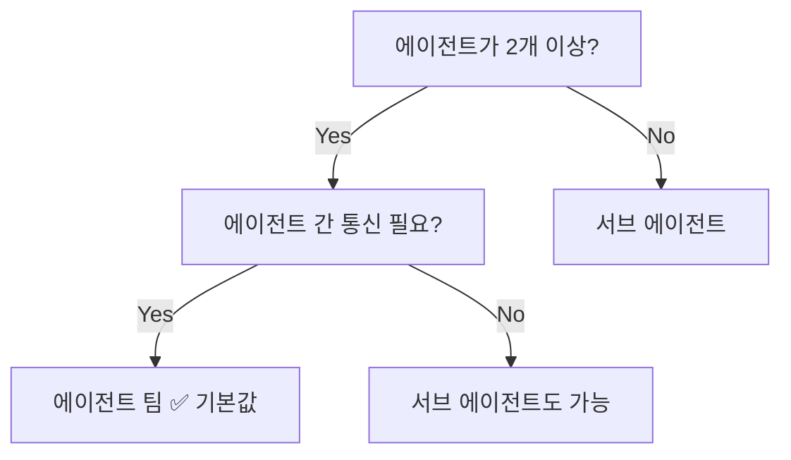
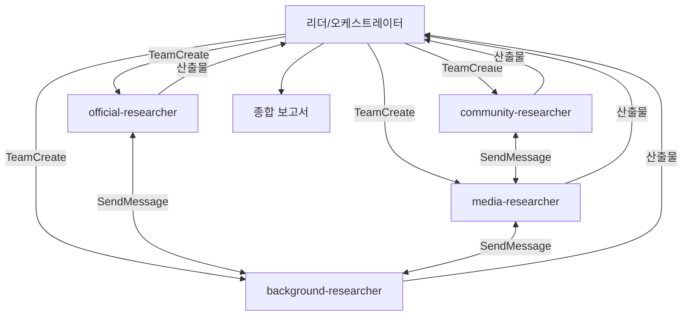

# Harness — Agent Team & Skill Architect

> **저장소:** [revfactory/harness](https://github.com/revfactory/harness) / **버전:** 1.1.0 / **라이선스:** Apache-2.0

**한 줄 요약:** "하네스 구성해줘"라고 말하면, 프로젝트에 맞는 에이전트 팀 + 스킬을 자동 생성해주는 **메타 스킬** (Claude Code 플러그인).

## 1. 이 플러그인이 해결하는 문제

Claude Code에서 복잡한 작업을 하려면 에이전트를 직접 정의하고(`.claude/agents/`), 스킬을 작성하고(`.claude/skills/`), 이들을 조율하는 오케스트레이터까지 만들어야 한다. Harness는 이 **설계 과정 자체를 자동화**한다.



## 2. 플러그인 구조

```
harness/
├── .claude-plugin/
│   ├── plugin.json              # 매니페스트 (name, version, author)
│   └── marketplace.json
└── skills/
    └── harness/
        ├── SKILL.md             # 핵심 — 7 Phase 워크플로우 (~500줄)
        └── references/          # 조건부 로딩 (Progressive Disclosure)
            ├── agent-design-patterns.md   # 6가지 아키텍처 패턴
            ├── orchestrator-template.md   # 오케스트레이터 템플릿
            ├── team-examples.md           # 5개 실전 팀 구성 예시
            ├── skill-writing-guide.md     # 스킬 작성 가이드
            ├── skill-testing-guide.md     # 테스트/평가 방법론
            └── qa-agent-guide.md          # QA 에이전트 설계 가이드
```

::: tip Progressive Disclosure
`SKILL.md` 본문은 500줄 이내로 유지하고, 상세 내용은 `references/`에 분리한다. 트리거 시 SKILL.md만 로딩하고, 필요한 reference만 조건부로 읽어오는 3단계 구조다.

| 단계 | 로딩 시점 | 크기 |
|------|----------|------|
| Metadata (name + description) | 항상 | ~100단어 |
| SKILL.md 본문 | 스킬 트리거 시 | <500줄 |
| references/ | 필요할 때만 | 무제한 |
:::

## 3. 핵심 워크플로우 — 7 Phase



### Phase 0: 현황 감사

하네스 스킬이 트리거되면 **가장 먼저 기존 상태를 확인**한다.

| 상태 | 분기 |
|------|------|
| 에이전트/스킬 디렉토리가 비어있음 | **신규 구축** → Phase 1부터 전체 실행 |
| 기존 하네스 + 새 에이전트/스킬 추가 요청 | **기존 확장** → 필요한 Phase만 선택 |
| 감사/수정/동기화 요청 | **운영/유지보수** → 별도 워크플로우 |

### Phase 1: 도메인 분석

프로젝트를 파악하는 단계. 기술 스택, 데이터 모델, 주요 모듈을 탐색하고, **사용자 숙련도**까지 감지하여 이후 커뮤니케이션 톤을 조절한다.

### Phase 2: 팀 아키텍처 설계

**실행 모드를 먼저 결정**하고, 6가지 아키텍처 패턴 중 적합한 것을 선택한다.

### Phase 3~4: 에이전트 & 스킬 생성

에이전트는 `.claude/agents/{name}.md`에, 스킬은 `.claude/skills/{name}/SKILL.md`에 생성. 각 Phase 완료 시 **CLAUDE.md에 즉시 동기화**한다 (세션 중단 대비).

### Phase 5: 통합 & 오케스트레이션

오케스트레이터 스킬을 생성하여 전체 팀을 조율. 데이터 흐름, 에러 핸들링, CLAUDE.md 최종 등록까지 수행한다.

### Phase 6: 검증 & 테스트

구조 검증, 트리거 검증 (should-trigger / should-NOT-trigger), 드라이런, **with-skill vs without-skill 비교 실행**까지 수행.

### Phase 7: 하네스 진화

한 번 만들고 끝이 아니라 **피드백 기반 반복 개선**. 같은 피드백이 2회 반복되면 자동으로 진화를 제안한다.

## 4. 실행 모드

| 모드 | 핵심 도구 | 언제 쓰나 |
|------|----------|----------|
| **에이전트 팀** (기본) | `TeamCreate`, `SendMessage`, `TaskCreate` | 2개 이상 에이전트가 협업할 때 |
| **서브 에이전트** | `Agent(run_in_background)` | 에이전트 1개 또는 통신 불필요 시 |



### 에이전트 팀 모드

팀원들이 `SendMessage`로 **직접 소통**하고, 공유 작업 목록(`TaskCreate`)으로 자체 조율한다. 리더는 모니터링만.

```
[리더] ←→ [팀원A] ←→ [팀원B]
  ↕          ↕          ↕
  └──── 공유 작업 목록 ────┘
```

**제약사항:**
- 세션당 한 팀만 활성화 (Phase 간 팀 재구성은 가능)
- 중첩 팀 불가 (팀원이 자기 팀 생성 불가)
- 리더 고정 (이전 불가)

### 서브 에이전트 모드

메인이 직접 호출하고 결과만 받는 경량 구조. 서브 에이전트끼리는 통신하지 않는다.

## 5. 6가지 아키텍처 패턴

### 5-1. 파이프라인

```
[분석] → [설계] → [구현] → [검증]
```

순차 의존 작업. 이전 단계의 출력이 다음 단계의 입력.
- **예시:** SF 소설 집필 — 세계관 → 캐릭터 → 플롯 → 집필 → 편집
- **주의:** 병목이 전체를 지연시킴

### 5-2. 팬아웃/팬인

```
       ┌→ [전문가A] ─┐
[분배] ├→ [전문가B] ─┼→ [통합]
       └→ [전문가C] ─┘
```

병렬 독립 작업 후 결과 통합. **에이전트 팀의 가장 자연스러운 패턴.**
- **예시:** 종합 리서치 — 공식/미디어/커뮤니티/배경 동시 조사
- **핵심:** 팀원들이 발견을 실시간 공유하여 조사 방향을 수정

### 5-3. 전문가 풀

```
[라우터] → { 전문가A | 전문가B | 전문가C }
```

입력 유형에 따라 적절한 전문가를 선택 호출. **서브 에이전트가 더 적합.**
- **예시:** 코드 리뷰 — 보안/성능/아키텍처 전문가 중 해당 영역만

### 5-4. 생성-검증

```
[생성] → [검증] → (문제시) → [생성] 재실행
```

산출물의 품질 보장이 중요할 때. 최대 재시도 횟수(2~3회) 설정 필수.
- **예시:** 웹툰 — artist 생성 → reviewer 검수 → 문제 패널 재생성

### 5-5. 감독자

```
         ┌→ [워커A]
[감독자] ─┼→ [워커B]
         └→ [워커C]
```

팬아웃과 달리 **런타임에 동적으로** 작업을 분배.
- **예시:** 대규모 코드 마이그레이션 — 파일 배치를 동적 할당

### 5-6. 계층적 위임

```
[총괄] → [팀장A] → [실무자A1, A2]
       → [팀장B] → [실무자B1]
```

재귀적 분해. 깊이 2단계 이내 권장.
- **주의:** 에이전트 팀은 중첩 불가 → 1단계 팀 + 2단계 서브 에이전트로 구현

### 복합 패턴

실전에서는 단일 패턴보다 조합이 일반적이다.

| 복합 패턴 | 구성 | 예시 |
|----------|------|------|
| 팬아웃 + 생성-검증 | 병렬 생성 후 각각 검증 | 다국어 번역 |
| 파이프라인 + 팬아웃 | 순차 중 일부 병렬화 | 분석(순차) → 구현(병렬) → 테스트(순차) |
| 감독자 + 전문가 풀 | 감독자가 전문가를 동적 호출 | 고객 문의 처리 |

## 6. 에이전트 정의 구조

모든 에이전트는 반드시 **파일로 정의**한다. 빌트인 타입(`general-purpose`, `Explore`, `Plan`)이라도 파일 생성 필수.

```markdown
---
name: agent-name
description: "1-2문장 역할 설명. 트리거 키워드 나열."
---

# Agent Name — 역할 한줄 요약

## 핵심 역할
## 작업 원칙
## 입력/출력 프로토콜
## 팀 통신 프로토콜     ← 에이전트 팀 모드에서 필수
## 에러 핸들링
## 협업
```

::: info 에이전트 타입 선택
| 상황 | 타입 |
|------|------|
| 역할이 복잡하고 재사용 | 커스텀 (`.claude/agents/`) |
| 단순 조사/수집 | `general-purpose` |
| 코드 읽기만 | `Explore` (읽기 전용) |
| 설계/계획만 | `Plan` (읽기 전용) |
| QA 검증 (스크립트 실행 필요) | `general-purpose` (`Explore`는 불가) |
:::

## 7. 스킬 설계 원칙

### Description = 유일한 트리거

Claude는 description만 보고 스킬 사용 여부를 결정한다. **"pushy"하게** 작성해야 한다.

```yaml
# 나쁜 예
description: "PDF 문서를 처리하는 스킬"

# 좋은 예
description: "PDF 읽기, 텍스트/테이블 추출, 병합, 분할, 회전, 워터마크,
  암호화, OCR 등 모든 PDF 작업 수행. .pdf 파일을 언급하거나 PDF 산출물을
  요청하면 반드시 이 스킬을 사용할 것."
```

### 본문 작성 원칙

| 원칙 | 설명 |
|------|------|
| **Why를 설명하라** | "ALWAYS/NEVER" 대신 이유를 전달. 엣지 케이스 대응력 향상 |
| **Lean하게 유지** | 컨텍스트 윈도우는 공공재. 500줄 이내 |
| **일반화하라** | 특정 예시에만 맞는 좁은 규칙 → 원리 수준으로 |
| **명령형으로** | "~합니다" 대신 "~한다", "~하라" |

### 에이전트 vs 스킬 구분

| | 에이전트 | 스킬 |
|-|---------|------|
| 역할 | **"누가"** 하는가 | **"어떻게"** 하는가 |
| 위치 | `.claude/agents/` | `.claude/skills/` |
| 트리거 | `Agent` 도구로 명시적 호출 | 사용자 요청 키워드 매칭 |

## 8. 오케스트레이터

개별 에이전트와 스킬을 **하나의 워크플로우로 엮는** 상위 스킬.

### 에이전트 팀 모드 패턴

```
Phase 0: 컨텍스트 확인 (초기/후속/부분 재실행 판별)
Phase 1: 준비 — _workspace/ 생성
Phase 2: TeamCreate + TaskCreate
Phase 3: 팀원 자체 조율 (SendMessage)
Phase 4: 결과 수집 & 통합
Phase 5: 팀 정리, _workspace/ 보존
```

### 데이터 전달 프로토콜

| 전략 | 방식 | 적합한 경우 |
|------|------|-----------|
| 메시지 기반 | `SendMessage` | 실시간 조율, 가벼운 상태 전달 |
| 태스크 기반 | `TaskCreate`/`TaskUpdate` | 진행상황 추적, 의존 관계 관리 |
| 파일 기반 | 약속된 경로에 파일 읽기/쓰기 | 대용량 산출물, 감사 추적 |

파일 기반 규칙:
- 중간 산출물은 `_workspace/` 하위에 저장
- 파일명: `{phase}_{agent}_{artifact}.{ext}`
- `_workspace/`는 삭제하지 않음 (사후 검증용)

## 9. 검증 체계

### 트리거 검증

| 유형 | 개수 | 목적 |
|------|------|------|
| Should-trigger | 8~10개 | 다양한 표현으로 트리거되는지 |
| Should-NOT-trigger | 8~10개 | **near-miss** 쿼리에 잘못 트리거되지 않는지 |

::: warning Near-miss가 핵심
"피보나치 함수 작성" 같은 명백히 무관한 쿼리는 테스트 가치가 없다. "이 엑셀의 차트를 PNG로 추출해줘" (xlsx 스킬 vs 이미지 변환)처럼 **경계가 모호한 쿼리**가 좋은 테스트 케이스다.
:::

### With-skill vs Without-skill 비교

같은 프롬프트를 스킬 있는 에이전트 / 없는 에이전트에서 **병렬 실행**하여 스킬의 부가가치를 측정한다.

### 실제 효과 (연구 결과)

[revfactory/claude-code-harness](https://github.com/revfactory/claude-code-harness) 에서 15개 작업으로 측정한 결과:

| 지표 | Without | With | 개선 |
|------|---------|------|------|
| 평균 품질 점수 | 49.5 | 79.3 | **+60%** |
| 승률 | — | — | **100%** (15/15) |
| 출력 분산 | — | — | **-32%** |

작업 복잡도가 높을수록 개선 폭이 커진다: Basic +23.8, Advanced +29.6, Expert +36.2.

## 10. QA 에이전트 — 경계면 교차 비교

QA의 핵심은 **"존재 확인"이 아니라 "경계면 교차 비교"**다.

### 실제 프로젝트에서 발견된 버그 패턴

| 버그 | 경계면 | 원인 |
|------|--------|------|
| `projects?.filter is not a function` | API → 훅 | API가 `{projects:[]}`, 훅이 배열 기대 |
| 대시보드 링크 전부 404 | 파일경로 → href | `/dashboard/` 접두사 누락 |
| 테마 이미지 안 보임 | API → 컴포넌트 | `thumbnailUrl` vs `thumbnail_url` |
| 생성 페이지 영원히 대기 | 상태전이 → 코드 | `template_approved` 전이 코드 누락 |

### 교차 비교 검증 영역

```
API route의 NextResponse.json() shape
    ↕ 비교
대응 훅의 fetchJson<T> 타입
```

```
src/app/ 하위 page 파일 경로
    ↕ 비교
코드 내 모든 href, router.push 값
```

```
STATE_TRANSITIONS 맵의 허용된 전이
    ↕ 비교
실제 .update({ status }) 코드
```

::: tip QA 설계 원칙
- `Explore` 타입 쓰지 말 것 → 스크립트 실행이 필요하므로 `general-purpose` 사용
- "양쪽을 동시에 읽어라" — API route **와** 대응 훅을 **같이** 읽어야 경계면 버그를 잡음
- 전체 완성 후 1회가 아니라, **각 모듈 완성 직후 즉시 실행** (incremental QA)
:::

## 11. 실전 예시

### 리서치 팀 (팬아웃/팬인, 에이전트 팀)



팀원들이 리더를 거치지 않고 **직접 소통**하여 발견을 공유한다.

### SF 소설 집필 (파이프라인 + 팬아웃, 팀 재구성)

```
Phase 1: TeamCreate(worldbuilder, character-designer, plot-architect)
         → 병렬 작업 + SendMessage로 일관성 조율
         → 팀 정리

Phase 2: Agent(prose-stylist) → 단독 집필 (서브 에이전트)

Phase 3: TeamCreate(science-consultant, continuity-manager)
         → 병렬 리뷰 + 발견 공유
         → 팀 정리

Phase 4: Agent(prose-stylist) → 리뷰 반영 수정
```

Phase별로 **팀을 해체하고 재구성**하는 패턴. `_workspace/`에 산출물이 보존되므로 새 팀이 이전 결과를 읽을 수 있다.

### 웹툰 제작 (생성-검증, 서브 에이전트)

에이전트가 2개뿐이고 결과 전달만 필요하므로 서브 에이전트가 적합.

```
Agent(webtoon-artist) → 패널 생성
Agent(webtoon-reviewer) → PASS/FIX/REDO 판정
→ REDO면 artist 재호출 (최대 2회)
```

## 12. 산출물 체크리스트

하네스 실행 후 확인할 항목:

- `.claude/agents/` — 에이전트 정의 파일 (빌트인 타입이라도 필수)
- `.claude/skills/` — 스킬 파일 (SKILL.md + references/)
- 오케스트레이터 스킬 1개 (데이터 흐름 + 에러 핸들링 + 테스트 시나리오)
- 모든 Agent 호출에 `model: "opus"` 명시
- `.claude/commands/` — 아무것도 생성하지 않음
- 스킬 description이 후속 작업 키워드 포함
- SKILL.md 500줄 이내
- CLAUDE.md에 하네스 컨텍스트 등록
- 트리거 검증 + 실행 테스트 완료

## 13. 설치 방법

```shell
# Marketplace에서 설치
/plugin marketplace add revfactory/harness
/plugin install harness@harness

# 또는 직접 설치
cp -r skills/harness ~/.claude/skills/harness
```

::: warning 사전 요구사항
에이전트 팀 기능이 활성화되어야 한다:
```shell
CLAUDE_CODE_EXPERIMENTAL_AGENT_TEAMS=1
```
:::
