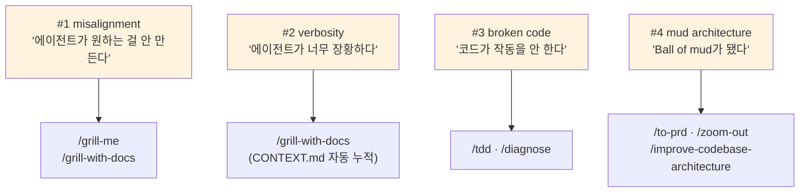
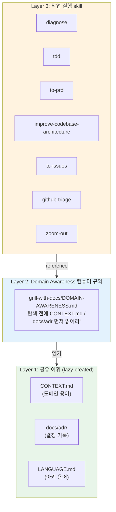
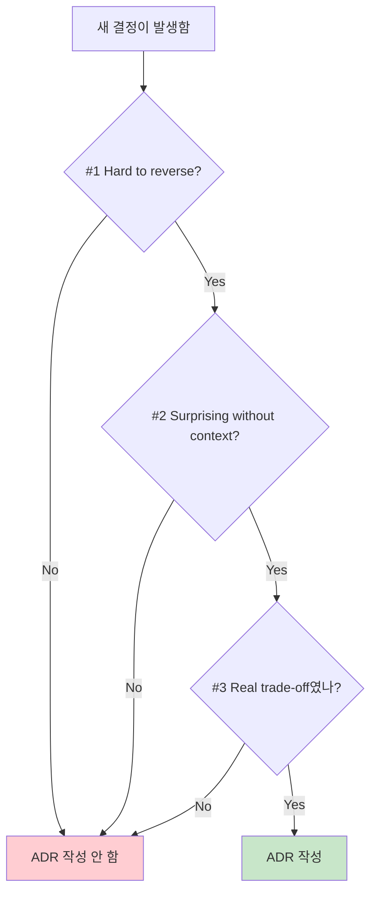
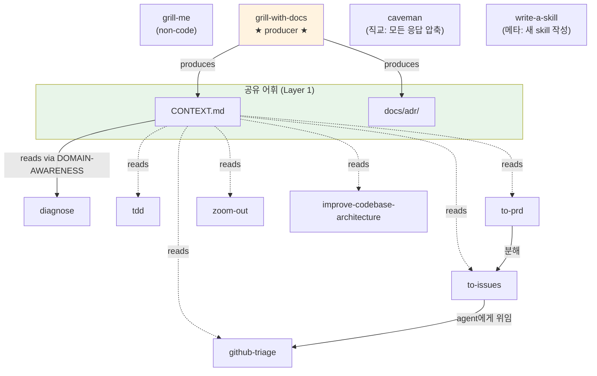

# Mattpocock Skills — Real Engineering 용 Skill 컬렉션

> **저장소:** [mattpocock/skills](https://github.com/mattpocock/skills) / **저자:** Matt Pocock / **라이선스:** MIT

**한 줄 요약:** Matt Pocock이 매일 쓰는 **"Real Engineering" 용 Claude/Codex agent skill 컬렉션**. 공통 어휘(`CONTEXT.md`)와 아키텍처 언어(`LANGUAGE.md`)를 진입점으로 두고, 그 위에 진단·테스트·계획·리팩터·이슈관리 skill들이 같은 어휘를 공유하며 동작하는 **레이어드 구조**.

## 1. 이 컬렉션이 해결하는 문제 — 4대 실패 모드

이 저장소의 README는 agent 작업의 **4가지 핵심 실패 모드**와 각 모드를 다루는 skill을 명시한다. 이게 컬렉션의 철학적 골격이다.



각 실패 모드와 처방 skill 매핑:

| # | 실패 모드 | 진단 | 처방 skill |
|---|---|---|---|
| 1 | misalignment | 인간↔에이전트 의도 불일치 | `grill-me`, `grill-with-docs` |
| 2 | verbosity | 공유 언어(DDD ubiquitous language) 부재 | `grill-with-docs` (CONTEXT.md 자동 누적) |
| 3 | broken code | feedback loop 부족 | `tdd`, `diagnose` |
| 4 | mud architecture | 설계 의식이 일상에 들어와 있지 않음 | `to-prd`, `zoom-out`, `improve-codebase-architecture` |

::: tip 다른 메타 스킬과의 차이
이 사이트에서 분석한 [Harness](./harness)는 **에이전트 팀 아키텍처 자동 생성**에 초점을 두고, [Skill Creator](./skill-creator)는 **개별 스킬의 품질 라이프사이클**을 다룬다. mattpocock/skills는 이 둘과 다르게 **"매일 쓰는 도구"의 큐레이션**이다 — 메타 스킬이 아니라 일상 워크플로 skill의 모음.
:::

## 2. 저장소 구조 — Bucket 운영

```
skills/
├── .claude-plugin/
│   └── plugin.json              ← 플러그인으로 노출할 skill을 명시적 등록
├── CLAUDE.md                    ← bucket 운영 규칙
├── README.md                    ← 철학 + reference 카탈로그
├── scripts/
│   └── link-skills.sh           ← skills/**/SKILL.md → ~/.claude/skills/ 심볼릭 링크
└── skills/
    ├── engineering/             ← 코드 작업 daily-driver (8개)
    ├── productivity/            ← 비-코드 워크플로 daily-driver (3개)
    ├── misc/                    ← 보존하되 자주 안 씀 (4개)
    ├── personal/                ← 본인 셋업 전용, 플러그인 비공개 (2개)
    └── deprecated/              ← 더 이상 안 씀 (5개)
```

### Bucket 운영 규칙 (CLAUDE.md)

| 규칙 | 내용 |
|---|---|
| README/plugin.json 동기화 | `engineering/`, `productivity/`, `misc/` skill은 **반드시** 둘 다 등록 |
| 비공개 bucket | `personal/`, `deprecated/`는 README/plugin.json에 **노출 금지** |
| 링크 형식 | README의 skill 이름은 그 SKILL.md로 직링크 |
| bucket README | 각 bucket마다 README.md에 1줄 설명과 함께 모든 skill 나열 |

::: warning README ↔ plugin.json 차이
`misc/*` 4개는 README에는 있지만 plugin.json에는 없다. 의도된 차이로 보임 — README는 reference 카탈로그, plugin.json은 자동 로딩 대상.
:::

### plugin.json 등록 (자동 로딩 대상 11개)

```json
{
  "name": "mattpocock-skills",
  "skills": [
    "./skills/engineering/diagnose",
    "./skills/engineering/grill-with-docs",
    "./skills/engineering/github-triage",
    "./skills/engineering/improve-codebase-architecture",
    "./skills/engineering/tdd",
    "./skills/engineering/to-issues",
    "./skills/engineering/to-prd",
    "./skills/engineering/zoom-out",
    "./skills/productivity/caveman",
    "./skills/productivity/grill-me",
    "./skills/productivity/write-a-skill"
  ]
}
```

## 3. 핵심 아키텍처 — 공유 어휘 레이어

이 컬렉션의 가장 비-자명한 통찰은 **평면적 skill 묶음이 아니라 3-레이어 구조**라는 점이다.



### Producer vs Consumer 분리

| 역할 | skill | 동작 |
|---|---|---|
| **Producer** | `grill-with-docs` | CONTEXT.md / docs/adr 를 lazily 생성·갱신 |
| **Producer** | `improve-codebase-architecture` | 새 deep-module 명명 시 CONTEXT.md 갱신 |
| **Consumer** | 7개 skill | 읽고, 동일 어휘를 산출물에 사용 |

`DOMAIN-AWARENESS.md`를 reference하는 skill: **diagnose, improve-codebase-architecture, tdd, to-issues, to-prd, zoom-out, github-triage** — 즉 코드를 탐색하는 모든 active skill이 같은 진입 규약을 강제한다.

::: tip 왜 이게 중요한가
산출물(이슈 제목, refactor 제안, 가설, 테스트 이름)이 **모두 동일 어휘**를 쓰면:
- 토큰이 절약된다 (재정의/번역 비용 ↓)
- variables / functions / files가 일관 명명된다
- agent가 codebase를 탐색하기 쉬워진다
- agent가 thinking에 쓰는 토큰이 줄어든다 — 더 간결한 언어를 가지므로
:::

## 4. Engineering Bucket — 일상 코드 작업 8개

| Skill | 한 줄 | 핵심 메커니즘 |
|---|---|---|
| **diagnose** | 어려운 버그·성능 회귀 진단 6단계 | Phase 1에서 **빠른 결정적 feedback loop 만들기에 집착** → reproduce → 3-5개 falsifiable 가설 → 변수 1개씩 instrument → fix + regression test → 사후 정리 |
| **grill-with-docs** | plan을 도메인 모델에 대해 압박 면접 | 한 번에 한 질문씩, **CONTEXT.md를 inline 갱신**, ADR은 3가지 조건 충족 시에만 제안. `disable-model-invocation: true` |
| **github-triage** | 라벨 기반 state machine으로 issue 분류 | `unlabeled → needs-triage → {needs-info, ready-for-agent, ready-for-human, wontfix}`. 모든 댓글에 AI disclaimer 강제. `.out-of-scope/`로 거부 사유 누적 |
| **improve-codebase-architecture** | shallow→deep module 전환 기회 발굴 | 자체 어휘(`LANGUAGE.md`) 강제, 후보를 numbered list로 제시 후 grilling, ADR 충돌 명시 |
| **tdd** | red-green-refactor 한 슬라이스씩 | **horizontal slice 안티패턴 명시 거부** (모든 테스트 먼저 → 모든 구현 ❌). 한 테스트→한 구현 vertical slice |
| **to-issues** | plan/PRD를 vertical-slice GitHub issue 더미로 분해 | 각 슬라이스: HITL or AFK, blocked-by, user stories. 의존성 순서대로 `gh issue create` |
| **to-prd** | 현재 대화 컨텍스트 → PRD GitHub issue | **인터뷰 안 함** — 이미 합의된 것을 합성. 7섹션 템플릿 |
| **zoom-out** | 한 단계 위 추상화로 모듈 지도 그리기 | 본문 1줄짜리 가벼운 skill. CONTEXT.md 어휘 사용. `disable-model-invocation: true` |

### 4-1. diagnose의 Phase 1 절대주의

`diagnose`는 6 phase지만 **Phase 1(feedback loop 구축)이 압도적**이다.

> "Build the right feedback loop, and the bug is 90% fixed. ... If you don't have one, no amount of staring at code will save you."

10가지 feedback loop 종류를 우선순위 순으로 나열:

```mermaid
flowchart LR
    A["1. Failing test"] --> B["2. Curl/HTTP"]
    B --> C["3. CLI fixture"]
    C --> D["4. Headless browser"]
    D --> E["5. Trace replay"]
    E --> F["6. Throwaway harness"]
    F --> G["7. Property/fuzz"]
    G --> H["8. Bisection"]
    H --> I["9. Differential"]
    I --> J["10. HITL bash (마지막 수단)"]
```



비결정적 버그는 "재현률을 올려라" — 1% 플레이크는 디버그 불가, 50%면 가능.

### 4-2. tdd의 horizontal slice 거부

이 skill의 거의 첫머리에 박아둔 안티패턴:

> "DO NOT write all tests first, then all implementation."

이유:
- 일괄 작성된 테스트는 *상상한* 행동을 테스트
- shape (자료구조/시그니처)에 의존하게 됨
- 진짜 변경엔 둔감, 무관한 변경엔 깨짐

처방: **vertical slice tracer bullet** — 한 테스트 → 한 구현 → 반복. **RED 중에 절대 refactor 금지**.

```
WRONG (horizontal):
  RED:   test1, test2, test3, test4, test5
  GREEN: impl1, impl2, impl3, impl4, impl5

RIGHT (vertical):
  RED→GREEN: test1→impl1
  RED→GREEN: test2→impl2
  ...
```

### 4-3. improve-codebase-architecture의 의견 있는 재정의

이 skill의 `LANGUAGE.md`는 같은 단어라도 의도적으로 **재정의**하고 그 이유를 적었다.

| 용어 | 이 컬렉션의 정의 | 회피 |
|---|---|---|
| **Module** | "interface와 implementation을 가진 모든 것" (스케일 무관) | unit/component/service |
| **Interface** | 타입 시그니처 + 불변식 + 순서 + 에러 모드 + config + 성능 특성 | API/signature (좁음) |
| **Depth** | **leverage at the interface** (Ousterhout의 line-ratio 거부) | — |
| **Seam** | "현장 편집 없이 행동 변경 가능한 위치" (Michael Feathers) | boundary (DDD와 충돌) |

::: warning Ousterhout과의 의도적 충돌
"depth as ratio of implementation-lines to interface-lines"는 *A Philosophy of Software Design*에서 유명한 정의지만, 이 skill은 그것을 **명시적으로 거부**한다. 이유: "implementation 패딩을 보상한다." 대신 **leverage 기반 정의**를 채택.
:::

핵심 원칙:
- **The deletion test**: 모듈을 지웠다고 가정 → 복잡도가 사라지면 pass-through, 여러 caller에 분산되면 값을 했음
- **One adapter = hypothetical seam, two adapters = real seam**
- **The interface is the test surface**

## 5. Productivity & Misc Bucket

### Productivity (3개)

| Skill | 한 줄 |
|---|---|
| **caveman** | 토큰 ~75% 압축 응답 모드. 관사·필러·인사 제거, 기술적 정확성 유지. 보안경고/파괴적 작업/clarify 요청 시 일시 해제 |
| **grill-me** | `grill-with-docs`의 **non-code 버전** — 본문 5줄. 한 번에 한 질문, 코드로 답할 수 있으면 코드 탐색 |
| **write-a-skill** | 새 skill 작성 가이드. 100라인 SKILL.md, description은 1024자 이하 + "Use when..." 트리거 |

### Misc (4개)

| Skill | 한 줄 |
|---|---|
| **git-guardrails-claude-code** | Claude Code PreToolUse hook으로 `git push/reset --hard/clean -f/branch -D/checkout ./restore .` 차단 |
| **migrate-to-shoehorn** | 테스트 파일의 `as Type` → `fromPartial()` 마이그레이트. **테스트 코드 한정** |
| **scaffold-exercises** | 강의 exercises 디렉토리 스캐폴드. lint 통과시키는 게 목표 |
| **setup-pre-commit** | Husky v9+ + lint-staged + Prettier + typecheck/test 의 pre-commit hook 셋업 |

### 비공개 bucket

| Bucket | 항목 | 용도 |
|---|---|---|
| `personal/` | edit-article, obsidian-vault | 본인 셋업 전용. plugin/README 노출 안 함 |
| `deprecated/` | design-an-interface, qa, request-refactor-plan, triage-issue, ubiquitous-language | 진화 흔적. 5개 모두 active skill로 흡수됨 |

::: info deprecation 패턴
`triage-issue` → `github-triage`, `ubiquitous-language` → `grill-with-docs/CONTEXT-FORMAT.md`, `request-refactor-plan` → `improve-codebase-architecture`로의 **흡수 경로**가 보인다. 의도된 통합·정제.
:::

## 6. 핵심 디자인 결정들

### 6-1. SKILL.md frontmatter 컨벤션

모든 SKILL.md는 동일 패턴:

```yaml
---
name: skill-name
description: <what it does>. Use when <specific triggers — keywords, contexts>.
disable-model-invocation: true  # 일부만 (자동 트리거 끄기)
---
```

`disable-model-invocation: true` 가 붙은 skill (= 자동 트리거 OFF):
- `grill-with-docs` — 인터뷰 모드는 사용자가 명시적으로 시작해야 의미
- `zoom-out` — "이 코드 모르겠다"라는 명시적 신호 없이 자동 호출하면 무의미

### 6-2. ADR 발행 게이팅 — 3조건 모두 충족 시에만



→ "영원할 결정"만 ADR. 이게 ADR을 가볍게 유지하는 트릭.

### 6-3. Lazy creation 원칙

`CONTEXT.md`/`docs/adr/`는 첫 용어/결정 발생 시에만 생성된다. 빈 문서를 강요하지 않는다.

> "If any of these files don't exist, **proceed silently**. Don't flag their absence; don't suggest creating them upfront."

### 6-4. caveman의 자동-해제 예외

토큰 절약 모드지만, 다음 상황엔 자동으로 일시 해제:

- 보안 경고
- 비가역 작업 확인
- 다단계 시퀀스 (조각 순서가 오해 위험)
- 사용자가 clarify 요청

→ 안전과 정확성이 토큰 절약보다 우위라는 명시적 trade-off.

## 7. Skill 간 호출 그래프



전형적 풀-사이클 워크플로:

1. **`grill-me`** 또는 **`grill-with-docs`** 으로 정렬 + 어휘 누적
2. **`to-prd`** 로 PRD 발행
3. **`to-issues`** 로 vertical slice 분해
4. **`github-triage`** 로 issue 라벨링·`ready-for-agent` 승격
5. agent가 **`tdd`** 로 구현
6. 버그 발생 시 **`diagnose`** → 필요 시 **`improve-codebase-architecture`** 후속
7. 익숙치 않은 영역은 **`zoom-out`**

## 8. 다른 메타 스킬과의 위치 비교

| 관점 | [Harness](./harness) | [Skill Creator](./skill-creator) | mattpocock/skills |
|---|---|---|---|
| **목적** | 에이전트 팀 설계 자동화 | 스킬 라이프사이클 자동화 | 일상 워크플로 skill 큐레이션 |
| **레벨** | 메타 (스킬을 만드는 스킬) | 메타 (스킬을 만드는 스킬) | 일상 (직접 쓰는 스킬) |
| **산출물** | `.claude/agents/` + 오케스트레이터 | 검증된 SKILL.md + 최적화 description | 14개 skill 카탈로그 |
| **공통 어휘 강제** | 없음 | 없음 | **있음 (CONTEXT.md / LANGUAGE.md)** |
| **eval / 자동 테스트** | Phase 6에서 검증 | 핵심 루프가 테스트 | **없음** |
| **적합한 시점** | 새 프로젝트 구조 설계 | 개별 스킬 다듬기 | 매일 코드 작업 |

::: tip 어떤 걸 언제 쓰나
- 새 프로젝트에서 에이전트 팀이 필요 → **Harness**
- 만든 skill의 트리거 정확도를 자동 최적화 → **Skill Creator**
- 매일 코드 작업에서 misalignment/verbosity/broken/mud를 줄이고 싶다 → **mattpocock/skills**

이 셋은 **상호 배타적이지 않다**. mattpocock/skills를 일상에 깔고, 새 프로젝트 시작 시 Harness로 팀 구조를 짜고, 자체 skill을 만들 때 Skill Creator로 검증하는 식의 조합 가능.
:::

## 9. 강점 / 약점

### 강점

1. **공유 어휘 레이어** — 7개 skill이 같은 `CONTEXT.md`를 읽고 같은 용어를 산출 → 토큰 절약 + 일관성
2. **lazy creation 원칙** — `CONTEXT.md`/`docs/adr/`는 첫 용어/결정 발생 시에만 생성. 빈 문서 강요 X
3. **명시적 reject** — Ousterhout의 depth-as-ratio, all-tests-first TDD 등 인기 있는 안티패턴을 본문에서 거부 + 이유 설명
4. **producer/consumer 분리** — `grill-with-docs`(producer)와 `DOMAIN-AWARENESS.md`(consumer 규약) 분리
5. **deprecation 흔적 보존** — `deprecated/` 그대로 두어 진화 경로가 보임 (5개 → 통합형 4개로 흡수)
6. **메타 skill** — `write-a-skill`이 자체 컨벤션을 그대로 강제 (100라인, "Use when..." 트리거 등)

### 약점

1. **README ↔ plugin.json 동기화 미자동화** — `misc/*` 4개가 README엔 있고 plugin.json엔 없음. 의도 동기화 도구 부재
2. **DOMAIN-AWARENESS.md 위치 깊음** — `engineering/grill-with-docs/` 안에 묻혀 있어 모든 consumer가 `../grill-with-docs/DOMAIN-AWARENESS.md` 상대 경로로 참조. 공통 디렉토리(`skills/_shared/`)였다면 단일 책임이 더 분명
3. **`zoom-out` skill 1줄짜리** — 너무 가벼워 frontmatter 외 본문이 거의 없음. SKILL이라기보다 prompt snippet
4. **복수 컨텍스트(`CONTEXT-MAP.md`) 자동화 미상** — 큰 모노레포에서의 실패 모드 불명
5. **테스트가 없다** — meta: skill 자체에 대한 회귀 eval 부재. Skill Creator의 `run_eval.py` 같은 검증이 없음

## 10. 도입 권장

### 빠른 도입 (30초)

```bash
npx skills@latest add mattpocock/skills
```

원하는 skill만 골라 설치.

### 로컬 개발 도입 (이 저장소를 fork·clone해서)

```bash
./scripts/link-skills.sh
```

→ 모든 SKILL.md를 `~/.claude/skills/<name>` 으로 symlink.

### 권장 사용 순서 (신규 도입 팀 기준)

1. **`/grill-with-docs`** 한 번 돌려 첫 `CONTEXT.md` 시드 생성
2. **`/setup-pre-commit`** + **`/git-guardrails-claude-code`** 로 안전 가드레일 셋업
3. 매일 작업 시작:
   - 새 기능 → `/grill-me` 또는 `/grill-with-docs` → `/to-prd` → `/to-issues`
   - 버그 → `/diagnose`
   - 익숙치 않은 코드 → `/zoom-out`
4. 주 1회: `/improve-codebase-architecture` 로 ball-of-mud 점검

::: warning 조심할 것
- `disable-model-invocation: true`인 `grill-with-docs`/`zoom-out`은 자동 트리거 안 됨 → **명시적 호출 필요**
- `caveman` 모드는 한 번 켜지면 사용자가 "stop caveman" 하기 전엔 안 풀림 (보안/파괴 작업엔 일시 해제됨)
- `tdd` skill은 horizontal slicing을 강력히 거부함. 한 테스트씩 진행하지 않으면 의미 약해짐
:::

## 11. 결론

| 관점 | 핵심 |
|---|---|
| **본질** | 공유 어휘(`CONTEXT.md` + `LANGUAGE.md`) 위에 쌓인 17개 active skill (engineering 8 + productivity 3 + misc 4 + personal 2). 11개가 plugin으로 자동 노출 |
| **철학적 골격** | agent의 4대 실패 모드(misalignment / verbose / broken / mud) → 각각 grill, CONTEXT.md, tdd+diagnose, architecture-skill 로 처방 |
| **핵심 메커니즘** | `DOMAIN-AWARENESS.md`를 7개 skill이 공동 reference → 모든 산출물이 동일 어휘 사용 |
| **가장 깊은 한 가지** | `improve-codebase-architecture/LANGUAGE.md`의 Module/Interface/Depth/Seam/Adapter/Leverage/Locality 재정의 — Ousterhout과 명시적으로 충돌 |
| **deprecation 패턴** | 5개 deprecated skill이 결국 통합형 skill 4개로 흡수됨 — 의도된 진화 |

**한 줄로:** Harness가 "팀을 자동 설계", Skill Creator가 "스킬 품질을 보장"한다면, mattpocock/skills는 **"매일의 작업이 같은 어휘를 쓰게 강제하는 큐레이션"** 이다. 메타가 아닌 일상의 도구라는 점이 차별점.
