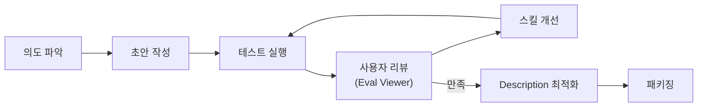
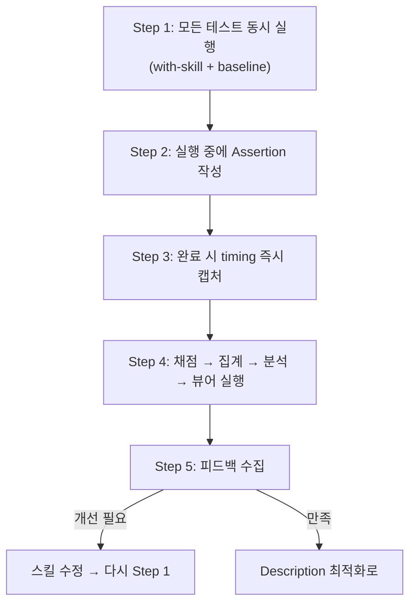
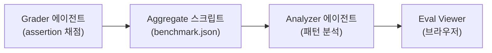

# Skill Creator — Anthropic 공식 스킬 생성 도구

> **저장소:** [anthropics/skills](https://github.com/anthropics/skills) / **제작:** Anthropic (Keith Lazuka) / **라이선스:** Apache-2.0

**한 줄 요약:** 스킬을 만들고, 테스트하고, 평가하고, 반복 개선하는 전체 라이프사이클을 자동화하는 **메타 스킬**. Anthropic이 직접 만든 "스킬을 만드는 스킬".

## 1. 이 스킬이 해결하는 문제

스킬을 잘 만드는 건 어렵다. Description이 적절한지, 트리거가 제대로 되는지, 산출물 품질이 충분한지를 확인하려면 **반복적인 테스트와 개선**이 필요하다. Skill Creator는 이 전체 과정을 체계화한다.



## 2. 플러그인 구조

```
skills/skill-creator/
├── SKILL.md              # 핵심 워크플로우 (~486줄)
├── agents/               # 전문 서브에이전트 3개
│   ├── grader.md          # Assertion 기반 채점
│   ├── comparator.md      # 블라인드 A/B 비교
│   └── analyzer.md        # 벤치마크 패턴 분석
├── references/
│   └── schemas.md         # 8개 JSON 스키마 정의
├── scripts/              # Python 자동화 스크립트 8개
│   ├── run_eval.py        # 트리거 평가 실행
│   ├── run_loop.py        # 최적화 루프 오케스트레이션
│   ├── improve_description.py  # Description 개선 제안
│   ├── aggregate_benchmark.py  # 벤치마크 집계
│   ├── generate_report.py      # HTML 리포트 생성
│   ├── package_skill.py        # .skill 파일 패키징
│   ├── quick_validate.py       # frontmatter 검증
│   └── utils.py               # SKILL.md 파서
├── eval-viewer/          # 브라우저 기반 리뷰 도구
│   ├── generate_review.py # 리뷰 서버/정적 HTML 생성
│   └── viewer.html        # 뷰어 UI (1327줄)
└── assets/
    └── eval_review.html   # 트리거 eval 편집 UI
```

::: tip Harness와의 차이
**Harness** = 에이전트 팀을 **설계**하는 메타 스킬 (아키텍처 중심)
**Skill Creator** = 개별 스킬을 **만들고 테스트**하는 메타 스킬 (품질 중심)

Harness는 "누가 무엇을 할지" 팀 구조를 설계하고, Skill Creator는 "이 스킬이 제대로 동작하는지" 품질을 검증한다. 상호 보완적.
:::

## 3. 핵심 워크플로우

### 3-1. 의도 파악 (Capture Intent)

사용자가 "X하는 스킬 만들어줘"라고 하면, 먼저 4가지를 파악한다:

1. **무엇을 하는 스킬인가?**
2. **언제 트리거되어야 하는가?** (어떤 사용자 표현/맥락)
3. **출력 형식은?**
4. **테스트 케이스가 필요한가?** — 객관적 검증 가능한 스킬(파일 변환, 데이터 추출)은 필요, 주관적 스킬(글쓰기 스타일)은 불필요

기존 대화에서 워크플로우를 추출하는 경우도 처리한다: "이걸 스킬로 만들어줘" → 대화에서 사용한 도구, 단계, 사용자 수정사항을 자동 추출.

### 3-2. 인터뷰 & 리서치

엣지 케이스, 입출력 형식, 성공 기준, 의존성을 사전에 파악. MCP 서버가 있으면 문서 검색이나 유사 스킬 조사를 **병렬로** 수행한다.

### 3-3. SKILL.md 작성

Harness 분석에서 다룬 것과 동일한 구조를 따르되, Skill Creator가 강조하는 추가 원칙:

| 원칙 | 설명 |
|------|------|
| **Why를 설명하라** | ALWAYS/NEVER 대신 이유를 전달. "오늘의 LLM은 *똑똑하다*" |
| **Lean하게 유지** | 트랜스크립트를 읽고, 비생산적인 지시는 제거 |
| **일반화하라** | 테스트 케이스에만 맞는 좁은 수정 = 오버피팅 |
| **반복 작업 번들링** | 3개 테스트에서 모두 같은 헬퍼 스크립트를 생성하면 → `scripts/`에 포함 |
| **초안 → 재검토** | 한 번에 완벽하게 쓰려 하지 말고, 초안-검토 사이클 |

### 3-4. 테스트 실행 & 평가

이 부분이 Skill Creator의 **핵심 차별점**이다. 5단계 연속 시퀀스:



#### Step 1: 모든 실행을 한 턴에 동시 발사

각 테스트 케이스마다 **with-skill + baseline 2개를 동시에** 스폰한다. with-skill만 먼저 돌리고 baseline은 나중에 하지 않는다.

| 상황 | Baseline |
|------|----------|
| 새 스킬 생성 | 스킬 없이 같은 프롬프트 실행 |
| 기존 스킬 개선 | 수정 전 스킬 스냅샷 |

#### Step 2: 실행 중에 Assertion 작성

서브에이전트들이 돌아가는 동안 **시간을 낭비하지 않고** assertion을 초안한다.

좋은 assertion의 조건:
- 객관적으로 참/거짓 판별 가능
- 이름만 봐도 무엇을 검사하는지 명확
- 프로그래밍 가능한 것은 스크립트로 검증 (눈으로 확인하지 않음)

#### Step 3: 완료 시 timing 즉시 캡처

서브에이전트 완료 알림에서 `total_tokens`와 `duration_ms`를 **즉시** 저장. 이 데이터는 알림 시점에만 접근 가능하고 이후 복구 불가.

#### Step 4: 채점 → 집계 → 분석 → 뷰어



#### Step 5: 피드백 수집

Eval Viewer에서 사용자가 각 테스트 케이스에 피드백을 남기고 "Submit All Reviews" → `feedback.json` 생성. 빈 피드백 = 이상 없음.

## 4. 전문 에이전트 3종

### Grader — 채점자

Assertion을 평가하고, **eval 자체의 품질도 비평**한다.

```
Input: expectations[], transcript, outputs/
Output: grading.json
```

**핵심 원칙:**
- PASS = 진짜 과제를 수행한 증거 (파일 이름만 맞고 내용이 틀리면 FAIL)
- FAIL = 증거 없음, 모순, 또는 표면적으로만 통과
- "약한 assertion이 통과하는 것은 실패보다 나쁘다" — 거짓 자신감을 만듬
- 산출물에서 implicit claim을 추출하여 교차 검증

::: info Eval Feedback
Grader는 채점만 하는 게 아니라 **eval 자체에 대한 개선 제안**도 한다:
- "이 assertion은 할루시네이션된 문서도 통과시킨다"
- "출력에서 전화번호가 틀렸는데 이걸 잡는 assertion이 없다"
:::

### Comparator — 블라인드 비교자

두 산출물을 **A/B로 익명화**하여, 어느 스킬이 만든 것인지 모른 채 품질을 판정.

```
Input: output_a, output_b, eval_prompt, expectations(optional)
Output: comparison.json (winner, rubric scores, reasoning)
```

**평가 루브릭:**
- Content (correctness, completeness, accuracy) → 1~5점
- Structure (organization, formatting, usability) → 1~5점
- 종합 점수 1~10

### Analyzer — 분석가

두 가지 역할을 수행:

**1) 비교 후 분석:** 왜 승자가 이겼는지 원인 분석 + 패자 스킬 개선 제안
**2) 벤치마크 분석:** 집계 통계가 숨기는 패턴 발견

| 찾는 패턴 | 의미 |
|----------|------|
| 양쪽 모두 100% 통과하는 assertion | 차별력 없음 (non-discriminating) |
| 양쪽 모두 실패하는 assertion | 스킬 범위 밖이거나 assertion 문제 |
| 고분산 eval | flaky하거나 비결정적 행동 |
| 시간/토큰 급증 | 스킬이 비생산적 작업을 유발 |

## 5. Description 최적화 시스템

스킬 품질에 만족하면, **트리거 정확도를 자동 최적화**한다.

### 5-1. Trigger Eval 쿼리 작성 (20개)

**Should-trigger (8~10개) + Should-NOT-trigger (8~10개)**

Skill Creator가 강조하는 쿼리 품질 기준:

```
# 나쁜 쿼리
"Format this data"
"Extract text from PDF"

# 좋은 쿼리
"ok so my boss just sent me this xlsx file (its in my downloads,
called something like 'Q4 sales final FINAL v2.xlsx') and she wants
me to add a column that shows the profit margin as a percentage.
The revenue is in column C and costs are in column D i think"
```

- 파일 경로, 개인적 맥락, 열 이름, 회사명 등 구체적 디테일 포함
- 소문자, 약어, 오타, 캐주얼한 표현 혼합
- Should-NOT-trigger는 **near-miss** — 키워드는 겹치지만 다른 도구가 적합한 쿼리

### 5-2. HTML 편집기에서 사용자 검토

`assets/eval_review.html` 템플릿으로 브라우저에서 쿼리를 편집/추가/삭제 가능.

### 5-3. 자동 최적화 루프

```bash
python -m scripts.run_loop \
  --eval-set <trigger-eval.json> \
  --skill-path <skill-path> \
  --model <current-model-id> \
  --max-iterations 5
```

내부 동작:
1. Eval set을 **Train 60% / Test 40%** 분할
2. 현재 description으로 각 쿼리를 **3회씩** 실행 → 트리거율 측정
3. 실패 케이스를 분석하여 개선된 description 제안
4. 새 description으로 재평가 (train + test 모두)
5. 최대 5회 반복
6. **Test set 기준으로** best description 선택 (과적합 방지)

::: warning 트리거 메커니즘 이해
Claude는 `available_skills` 목록에서 name + description만 보고 스킬 사용 여부를 결정한다. **단순한 쿼리는 스킬 없이도 처리 가능**하므로 description이 완벽해도 트리거되지 않을 수 있다. 복잡하고 전문적인 쿼리일수록 트리거 확률이 높다.
:::

## 6. 워크스페이스 구조

```
my-skill-workspace/
├── iteration-1/
│   ├── eval-table-extraction/          # 서술적 이름 사용
│   │   ├── eval_metadata.json
│   │   ├── with_skill/
│   │   │   ├── outputs/
│   │   │   ├── timing.json
│   │   │   └── grading.json
│   │   └── without_skill/
│   │       ├── outputs/
│   │       ├── timing.json
│   │       └── grading.json
│   ├── eval-multi-page-merge/
│   │   └── ...
│   └── benchmark.json
├── iteration-2/
│   └── ...                             # 이전 iteration 덮어쓰기 금지
└── evals/
    └── evals.json
```

## 7. JSON 스키마 체계 (8개)

데이터 일관성을 보장하는 표준 스키마:

| 스키마 | 용도 | 위치 |
|--------|------|------|
| `evals.json` | 테스트 케이스 정의 | `evals/` |
| `eval_metadata.json` | 개별 eval 메타데이터 | 각 eval 디렉토리 |
| `grading.json` | Grader 채점 결과 | 각 run 디렉토리 |
| `timing.json` | 실행 시간/토큰 | 각 run 디렉토리 |
| `metrics.json` | 도구 사용 통계 | `outputs/` |
| `benchmark.json` | 통합 벤치마크 집계 | iteration 루트 |
| `comparison.json` | 블라인드 비교 결과 | grading 디렉토리 |
| `analysis.json` | 분석가 인사이트 | grading 디렉토리 |

::: warning 필드명 주의
Eval Viewer가 정확한 필드명에 의존한다. `text`/`passed`/`evidence`를 써야 하며 `name`/`met`/`details` 등 변형은 뷰어가 빈 값을 표시한다.
:::

## 8. 환경별 동작 차이

Skill Creator는 **Claude Code, Claude.ai, Cowork** 3가지 환경을 모두 지원한다.

| 기능 | Claude Code | Claude.ai | Cowork |
|------|:-----------:|:---------:|:------:|
| 서브에이전트 병렬 실행 | O | X (순차) | O |
| Baseline 비교 | O | X (건너뜀) | O |
| Eval Viewer (브라우저) | O | X (인라인) | 정적 HTML |
| 정량적 벤치마크 | O | X | O |
| Description 최적화 | O (`claude -p`) | X | O |
| 블라인드 비교 | O | X | O |
| 패키징 (.skill) | O | O | O |

### Claude.ai에서의 차이점

- 서브에이전트 없이 **직접 스킬을 따라가며** 테스트 (less rigorous하지만 sanity check으로 유용)
- Eval Viewer 대신 대화에서 직접 결과 제시 + 인라인 피드백
- 기존 스킬 수정 시: 설치 경로가 read-only일 수 있으므로 `/tmp/`에 복사 후 편집

## 9. 개선 루프의 철학

Skill Creator의 SKILL.md에서 가장 인상적인 부분은 **개선 방법론**의 설명이다:

### "일반화하라"

> "여기서 사용자와 반복하는 건 몇 개의 예시뿐이다. 하지만 이 스킬은 수백만 번 사용될 수 있다. 이 예시에서만 작동하는 스킬은 쓸모없다."

테스트 케이스에 오버피팅하는 대신, **원리 수준에서 수정**한다.

### "Why를 설명하라"

> "ALWAYS나 NEVER를 대문자로 쓰고 있다면 노란 깃발이다. 가능하면 리프레이밍하고 이유를 설명하라."

### "Lean하게 유지하라"

> "트랜스크립트를 읽어라. 스킬이 모델에게 비생산적인 작업을 시키고 있다면, 그 부분을 삭제하고 결과를 보라."

### "사용자 숙련도에 적응하라"

> "요즘은 배관공이 터미널을 열고, 부모와 조부모가 'npm 설치하는 법'을 검색하는 추세다."

- "evaluation", "benchmark" → 경계선이지만 OK
- "JSON", "assertion" → 사용자가 아는 단서가 보일 때만 설명 없이 사용

## 10. Harness와의 비교

| 관점 | Harness | Skill Creator |
|------|---------|---------------|
| **목적** | 에이전트 팀 아키텍처 설계 | 개별 스킬 품질 보장 |
| **핵심 산출물** | `.claude/agents/` + `.claude/skills/` + 오케스트레이터 | 검증된 SKILL.md + 최적화된 description |
| **에이전트** | 커스텀 정의 (팀 통신 프로토콜 포함) | 3개 고정 (grader, comparator, analyzer) |
| **테스트** | Phase 6에서 검증 | 핵심 루프 자체가 테스트 |
| **Description 최적화** | 수동 (가이드라인 제공) | 자동 (train/test split + 5회 반복) |
| **브라우저 도구** | 없음 | Eval Viewer + Eval Review HTML |
| **Python 스크립트** | 없음 | 8개 (자동화 파이프라인) |
| **적합한 시점** | 프로젝트 초기 구조 설계 | 개별 스킬 품질 다듬기 |

## 11. 설치 방법

```shell
# Claude Code Marketplace에서 설치
/plugin marketplace add anthropics/skills
/plugin install anthropic-agent-skills@example-skills
```

또는 글로벌 스킬로 직접 설치:
```shell
cp -r skills/skill-creator ~/.claude/skills/skill-creator
```
